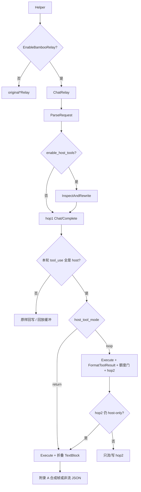
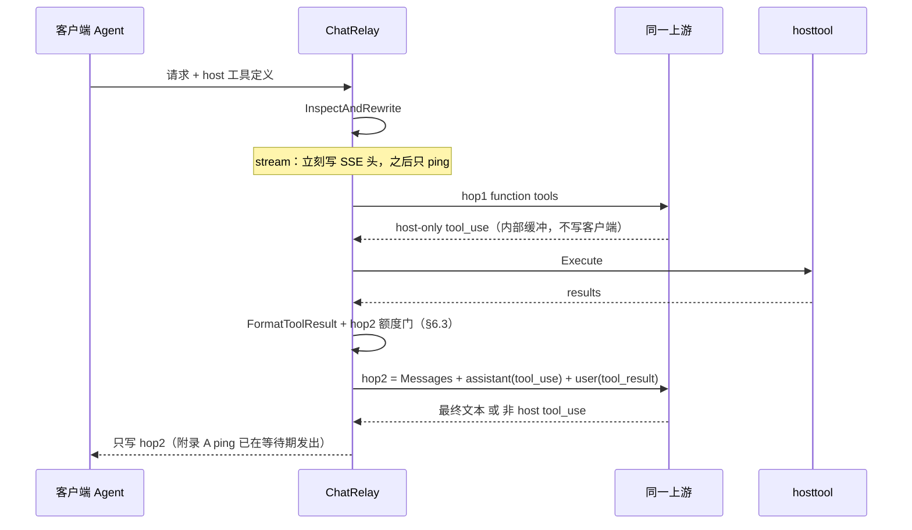

# RFC-0001：Bamboo 端侧工具（Host-side Tools）— WebSearch / WebFetch


| 字段       | 值                                                                                                                                    |
| -------- | ------------------------------------------------------------------------------------------------------------------------------------ |
| **RFC**  | RFC-0001                                                                                                                             |
| **标题**   | Bamboo 端侧工具（Host-side Tools）— WebSearch / WebFetch                                                                                   |
| **作者**   | TBD                                                                                                                                  |
| **日期**   | 2026-08-17                                                                                                                           |
| **状态**   | Draft / Proposed（R3 内部评审通过；产品已确认 A-thin）                                                                                             |
| **文档类型** | 可评审 RFC（非实现）                                                                                                                         |
| **最终路径** | [`docs/rfc/RFC-0001-bamboo-host-side-tools.md`](docs/rfc/RFC-0001-bamboo-host-side-tools.md)                                         |
| **前置文档** | [`docs/superpowers/specs/2026-06-18-bamboo-relay-bridge-design.md`](docs/superpowers/specs/2026-06-18-bamboo-relay-bridge-design.md) |
| **后续 RFC** | [`docs/rfc/RFC-0002-client-profile-web-search-return.md`](docs/rfc/RFC-0002-client-profile-web-search-return.md) — 按 User-Agent 隔离 web_search 返回信息；修订本 RFC Alt-6 / D3 逃生舱 / D16 Grok 回退 / §6.4 勘误。[`docs/rfc/RFC-0003-gemini-native-web-search-host-tool.md`](docs/rfc/RFC-0003-gemini-native-web-search-host-tool.md) — Gemini 原生 `googleSearch` / `googleSearchRetrieval` 归一为 `host.web_search` |
| **影响范围** | 仅 `EnableBambooRelay=true` **且** `enable_host_tools=true` 的 bamboo 对话中继；原生三段式路径必须 no-op                                              |
|          |                                                                                                                                      |


> **阅读约定**
>
> - **§ Key Decisions → v1 Locked** 是实现必须遵守的契约。
> - 实现前**没有**未决产品项。原 Q7 / Q-G 已按推荐项关闭，见 § Closed Questions。
> - 两种执行模式都有完整协议（含附录 A 流式帧）。实现者不得自行发明 SSE / usage / 回写形态。

---

## Overview

Claude Code、OpenCode、Codex 等 Agent 会在对话请求里携带 `WebSearch` / `WebFetch`（及同类别名），或携带供应商 server-side 内置工具（Anthropic `web_search_20250305` / `web_fetch_20250910`、OpenAI Responses `web_search` / `web_search_preview`）。现网有两类不受控结果：

1. **客户端 function tool**：模型返回 `tool_use`，客户端自己搜/抓。连第三方网关时本地执行常失败。
2. **供应商 server-side 工具**：上游执行并按次加价；不支持的渠道直接 400。

本 RFC 在 **bamboo 中继内核**（`relay/bamboo/bridge.go` `ChatRelay`）增加端侧工具层：识别并改写这类定义为普通 function，**禁止把执行权交给上游**；当本轮全部 `tool_use` 都是 host 工具时，由 new-api 执行，再让**同一上游**看到 `tool_result` 并产出最终回答。

**v1 对具名 Agent 客户端的产品路径是 Mode A-thin（`host_tool_mode=loop`）**：最多 **1 次额外上游 hop**。客户端看到的是最后一跳的综合文本（或最后一跳的非 host `tool_use`），**不是**网关私有的搜索 dump。这才是「网关模拟 AI 工具调用」。

**Mode B（`host_tool_mode=return`）不是 Agent 默认**。它是非 Agent / 调试回退：把结果折成 `TextBlock` 直接返回，模型不再综合。完整客户端契约见 §6.4，**不要**把它宣传成 Claude Code / OpenCode / Codex 的官方体验。

默认/原生三段式路径（`originalTextRelay` / `originalClaudeRelay` / `originalGeminiRelay` / `originalResponsesRelay`）**零改动、零行为变化**（Gemini pass-through 的既有 bamboo 缺口见 D1 注记）。

---

## Background &amp; Motivation

### 当前状态（源码已核实，2026-08-17）


| 事实                            | 位置                                                                                                                 | 含义                                                                         |
| ----------------------------- | ------------------------------------------------------------------------------------------------------------------ | -------------------------------------------------------------------------- |
| bamboo 灰度默认关                  | `setting/model_setting/bamboo_setting.go`：`EnableBambooRelay` 默认 false；`config.GlobalConfig.Register("bamboo", …)` | 关时四个 Helper 走原生三段式                                                         |
| 入口委托                          | `relay/claude_handler.go:144`、`compatible_handler.go:84`、`gemini_handler.go:141`、`responses_handler.go:159`        | 开关开时调用 `bamboo.ChatRelay`                                                  |
| Helper → ChatRelay 的 bytes    | 四个 Helper 均 `common.Marshal(request)` 后再传入                                                                         | **不是** `c.Request.Body`。inspect 看到的是 **已解析 DTO 的再序列化**                     |
| 内核                            | `relay/bamboo/bridge.go` `ChatRelay`                                                                               | `codec.ParseRequest` → `newProvider` → `doStreamRelay` / `doCompleteRelay` |
| 中间表示                          | `bamboo-messages@v0.9.8` `codec.RelayRequest`                                                                      | `Messages` / `System` / `Config` / `IsStream`                              |
| 工具列表                          | `bamboo.RequestConfig.Tools []bamboo.Tool`                                                                         | `Name` / `Description` / `InputSchema json.RawMessage`                     |
| 流式累加 tool_use                 | `doStreamRelay` `streamBlockAccum`                                                                                 | 写入 `info.BambooRelayData.ResponseBlocks`                                   |
| Interceptor                   | `provider.RequestInterceptor`                                                                                      | 只改上游 HTTP **body 字节**；new-api 仅用于 ParamOverride                            |
| SDK                           | `go.mod`：`bamboo-messages v0.9.8`                                                                                  | host tool 不得放进 `relaykit/`                                                 |
| 原生旁路（OpenAI/Claude/Responses） | pass-through、`chatCompletionsViaResponses`、Responses→Chat                                                          | 在 `ChatRelay` **之前** return                                                |
| Gemini 旁路                     | **没有** Helper 级 early-return；pass-through 只在 `originalGeminiRelay:180`                                             | bamboo 开启时 Gemini pass-through **已经**不生效；host tools 继承该缺口                  |


### 痛点

1. **上游加价 / 拒请求**：原生 Claude 路径用 `usage.server_tool_use.web_search_requests`（`relay/channel/claude/relay-claude.go` `countClaudeStreamBillableTools` → `claude_web_search_requests` → `collectToolSurchargeItem`，默认 `$10 / 1K`）。
2. **客户端工具在第三方网关失效**。
3. **bamboo codec 静默丢工具**（见下表）。Codex 的 Responses 内置 `web_search` 进入 bamboo 后模型可能根本看不到该工具。

### 源码级协议缺口

bamboo-messages v0.9.8 codec **不是无损工具透传**：


| 入口          | 解析行为                                                                                                                                                                             | 对 host tools 的后果                                                                                                                   |
| ----------- | -------------------------------------------------------------------------------------------------------------------------------------------------------------------------------- | ---------------------------------------------------------------------------------------------------------------------------------- |
| Anthropic   | `anthropicTool` **无 `type`**（`codec/anthropic/request.go:43–48`）；`parseTools` 只留 name/description/schema                                                                         | `{"type":"web_search_20250305","name":"web_search"}` → 名为 `web_search`、schema 常为空的 function                                        |
| OpenAI Chat | `parseTools`：`type != "function"` 则 skip；**无** `web_search_options` 字段                                                                                                           | 内置 type / `web_search_options` **整段丢失**                                                                                            |
| Responses   | `parseResponsesTools`：同样只收 `type=function`                                                                                                                                       | `{"type":"web_search"}` **丢失**                                                                                                     |
| Gemini      | 只走 `functionDeclarations`                                                                                                                                                        | `google_search` 不在本 RFC                                                                                                            |
| 回写上游        | `toolsToProvider` 固定 `Type:"function"`；Anthropic `buildTools` 只发 function                                                                                                        | bamboo 路径**不会**再以 server-tool type 打上游（host tools 关时亦然）                                                                            |
| 回写客户端       | **四个**出口 codec 都跳过 assistant 里的 `ToolResultBlock`：`codec/anthropic/response.go:145–149`、`openai/response.go:99–102`、`responses/response.go:121–124`、`gemini/response.go:145–148` | **任何模式**都不能把 `tool_result` 放进 `Response.Content` 再 `SerializeResponse`。结果只能：放进 **下一跳请求的 Messages**（Mode A），或折成 `TextBlock`（Mode B） |


### ChatRelay 入口 bytes ≠ HTTP raw body

四个 Helper 传入的是 DTO remash。inspect **必须**按再序列化后的 JSON 路径读，并在单测里从**真实 DTO** 出发（见 §4）。


| 入口 DTO                                                 | remash 后仍在的字段                                             | 说明                                                             |
| ------------------------------------------------------ | --------------------------------------------------------- | -------------------------------------------------------------- |
| `dto.ClaudeRequest.Tools` 为 `any`                      | `tools[].type` / `name` / `input_schema` / `max_uses`     | 反序列化为 `[]map[string]any` 时 type **会留下**（碰巧，但本 RFC 把它写成契约）      |
| `dto.GeneralOpenAIRequest`                             | `Tools[].Type`、`Tools[].Function.Name`、`WebSearchOptions` | bamboo `openaiRequest` 仍无 `web_search_options`，必须读 remash JSON |
| `dto.OpenAIResponsesRequest.Tools` 为 `json.RawMessage` | `GetToolsMap()` → `[]map[string]any` 的 `type`/`name`      | remash 保留内置 type                                               |
| Gemini DTO                                             | `functionDeclarations[].name`                             | 无 Google 内置检索字段可救                                              |


谁去读「真正的 HTTP raw body」会发现 body 已被消费。谁只扫 `Config.Tools` 会漏掉 Responses 内置 tool 与 `web_search_options`。

### 必须复用的既有能力

- **SSRF**：`setting/system_setting/fetch_setting.go` + `service.ValidateSSRFProtectedFetchURL` + `service.GetSSRFProtectedHTTPClient`。测试风格：`service/protected_fetch_client_test.go`。
- **工具加价**：`setting/operation_setting/tools.go` + `service/text_quota.go` `collectToolSurchargeItem` + `relay/common/tool_usage.go`。
- **JSON**：`common.Marshal` / `common.Unmarshal`。
- **quota**：`common/quota_math.go`；饱和 → `relayInfo.QuotaClamp` → `attachQuotaSaturation`。
- **计费会话**：`relay/common/billing.go` `BillingSettler` 只有 `Settle` / `Refund` / `NeedsRefund` / `GetPreConsumedQuota` / `Reserve`。**没有 remaining，也没有 `IsTrusted`。** hop2 门闩必须用 `model.GetUserQuota(id, true)` + 既有 `info.PriceData`，见 §6.3。
- **三库**：v1 无新表；配置 `bamboo.*`。

---

## Goals &amp; Non-Goals

### Goals

1. 仅在 bamboo 路径且 `enable_host_tools=true` 时生效；两层开关默认 false。
2. 识别 WebSearch / WebFetch 及别名，内部名 `host.web_search` / `host.web_fetch`；对外回写**客户端原始工具名**。
3. 剥掉 / 改写供应商 server-tool type，避免上游按内置 web_search 执行并加价。
4. 模型仍至少走一次上游推理以产生 `tool_use`。
5. **具名 Agent（Claude Code / OpenCode / Codex）v1 走 Mode A-thin**：执行后把 `tool_result` 送回**同一上游**，客户端看到最后一跳综合答案。
6. WebFetch 复用现有 SSRF 客户端；搜索默认 **不出网**（`search_backend=off`），显式打开第三方 egress 后才用 Exa/Parallel；生产可配 SearXNG。
7. 成功执行次数进入 `collectToolSurchargeItem`；失败不计次；**折叠文本不计 completion tokens**。
8. 可观测性挂 `BambooDebug` / `BambooRelayData` / `other.admin_info`（merge，不覆盖）。

### Non-Goals

- 原生 adaptor 三段式；pass-through / chatCompletionsViaResponses / Responses→Chat（OpenAI/Claude/Responses Helper 级旁路）。
- **修复 Gemini pass-through 被 bamboo 短路**——记为既有缺口，另开 PR；本 RFC 只诚实写进矩阵与测试。
- 非 host 工具（`bash` / `edit` / `apply_patch` / `shell` / 自定义 function）。
- Gemini `google_search`、`file_search`、`image_generation`、`/v1/alpha/search`。
- 改 `relaykit/`、升级 bamboo-messages 作为 v1 前置。
- 引入 `bamboo-agent` / 通用 HTTPTool / shell / 文件系统。
- **声称复刻 Claude Code 官方 WebFetch**（官方是 fetch → md → **另一模型按 `prompt` 作答**；本 RFC 不另开抽取模型）。Mode A 把页面 Markdown 作为 `tool_result` 交给**同一对话模型**，由它读 `prompt` 作答——这是网关能做的最近似，不是 Haiku 管道。
- v1 新表、新配置域、新 limiter 子系统。
- 实现生产代码（本文只做 RFC）。

---

## Key Decisions

### v1 Locked

下列事项已锁定。实现按此编码。实现前没有未决产品项。


| #   | 决策                  | 锁定值                                                                                                                                                                                                            | 理由                                                                                                                                                                                       |
| --- | ------------------- | -------------------------------------------------------------------------------------------------------------------------------------------------------------------------------------------------------------- | ---------------------------------------------------------------------------------------------------------------------------------------------------------------------------------------- |
| D1  | 作用路径                | 只做 bamboo `ChatRelay`；原生 `original*Relay` no-op                                                                                                                                                                | 用户硬约束。**注**：Gemini 在 `EnableBambooRelay=true` 时**没有** Helper 级 pass-through early-return（`gemini_handler.go:140–146` vs `:180`）。host tools 继承「bamboo 已破坏 Gemini pass-through」这一现状，测试必须覆盖 |
| D2  | Agent 默认执行模型        | `**host_tool_mode` 默认 `loop` = Mode A-thin**（最多 1 次额外 hop）。**产品确认：2026-08-17**                                                                                                                                 | 具名客户端要的是「工具被执行且模型综合出答案」。折叠成 dump **不是** tool-calling。Mode B 仅当运营显式设 `return`                                                                                                             |
| D3  | Mode B 定位           | **非 Agent / 调试回退**；契约见 §6.4                                                                                                                                                                                    | 避免把 dump 当 Claude Code 默认体验出货                                                                                                                                                            |
| D4  | 混合 tool_use         | 整包不执行、原样回传                                                                                                                                                                                                     | 网关不能代跑 bash                                                                                                                                                                              |
| D5  | 非 host 工具           | 原样定义 + 原样回传                                                                                                                                                                                                    | 安全面                                                                                                                                                                                      |
| D6  | 检测材料                | `ParseRequest` 之后同时扫 `**Config.Tools` + ChatRelay 入口 bytes（Helper 已 Marshal 的 DTO）**                                                                                                                           | 不是 HTTP raw body。路径表见 §4                                                                                                                                                                 |
| D7  | 改写                  | server-tool / 丢失的内置工具 → 注入带 **Name+Description+Schema** 的 function；已有 schema 保留                                                                                                                                | 空 Description 会导致模型不调；空 schema 会被 Anthropic 拒                                                                                                                                            |
| D8  | 搜索默认                | `**search_backend=off**`。Exa/Parallel 必须再开 `allow_third_party_search_egress=true`                                                                                                                              | 计费网关默认不得把用户 query 送到无 SLA 第三方。开箱对齐 OpenCode 的是**协议实现**，不是隐私默认                                                                                                                            |
| D9  | WebFetch 抽取         | 自抓 + 本地 HTML→md；**默认不走 Jina**                                                                                                                                                                                  | 避免 URL 泄漏                                                                                                                                                                                |
| D10 | 计费                  | 见 §11 算法：Usage = hops 的模型 token（B = 仅 hop1）；折叠文本 **不计** completion；成功次数写入 `BuiltInTools`（先 init）；按**声明名** `web_search` / `web_search_preview` / `web_fetch` 计次；`HostToolExecuted` 时跳过 `*-search-preview` 后缀 +1 | 防止 1MiB dump 按 completion 抽干 int32 quota；防止 preview 价目表错位与双计                                                                                                                             |
| D11 | 包位置                 | 执行在 `relay/bamboo/hosttool/`；**Plan 类型在 `relay/common`**                                                                                                                                                       | `RelayInfo` 不能 import `relay/bamboo`（循环）。对齐 `BambooRelayExtract` 模式                                                                                                                      |
| D12 | 配置域                 | 挂已有 `BambooSettings`（`bamboo.*`）                                                                                                                                                                               | 无新域、热更新                                                                                                                                                                                  |
| D13 | 不引入 bamboo-agent    | v1 不引入                                                                                                                                                                                                         | 安全面过大                                                                                                                                                                                    |
| D14 | 流式                  | 客户端要 SSE 时：**立刻写 SSE 头**；缓冲期间按附录 A 发 ping；**只把最后一跳（或 Mode B 合成帧）写给客户端**                                                                                                                                        | SDK **没有** `Response → []StreamEvent`。合成帧必须按附录 A 手工组 `StreamEvent` 再喂 `NewSerializer`。禁止在已写 `text/event-stream` 后改回 JSON                                                                 |
| D15 | v1 无新表              | options only；密钥 GET 本就会被 `*_api_key` 过滤                                                                                                                                                                        | 见 `controller/option.go:96–103`                                                                                                                                                          |
| D16 | A-thin 轮次           | 上游推理最多 2 次（hop1+hop2）。hop2 仍是 host-only `tool_use` → 执行后 **降级 Mode B 折叠**，禁止 hop3                                                                                                                              | 薄循环，可实现                                                                                                                                                                                  |
| D17 | A-thin hop2 额度门     | 按 **资金来源 × 是否信任** 分支（§6.3）。**禁止**在 `ChatRelay` 内再调 `ModelPriceHelper`（会覆盖 `info.PriceData`）。**禁止**把钱包 `Reserve` 的 error 当「余额不足」。**禁止** `GetUserQuota(id, false)` 做门闩。不新增 `BillingSettler` 方法                   | 已核实：`Reserve` 在 `s.trusted` 时直接 return（`billing_session.go:157`）；钱包 `reserveFunding` **允许余额为负**（`:246–252`）；缓存版 `GetUserQuota` 与异步 `DecreaseUserQuota` 竞态                                |
| D18 | 空响应重试               | host 执行后**禁止**置 `ContextKeyEmptyResponse`；controller（`controller/relay.go:244–250`）若见 `info.HostToolExecuted` 也跳过                                                                                              | 重试在 Helper **返回之后**，只在 Helper 里 skip 无效                                                                                                                                                  |
| D19 | 超时                  | 每个 fetch / MCP 调用必须 `context.WithTimeout`                                                                                                                                                                      | `RELAY_TIMEOUT` 默认 0，protected client 常常 **没有** `http.Client.Timeout`                                                                                                                    |
| D20 | v1 `loop` 语义        | 配置值 `loop` = 本文 A-thin，**不是**无界 ReAct。未实现执行前（PR1–PR3）读到 `loop` 只记录 plan，不执行                                                                                                                                    | 避免运营以为开了完整多轮                                                                                                                                                                             |
| D21 | Codex 别名            | 按本文别名表上线；抓包后再加行（原 Q7-A）                                                                                                                                                                                        | 产品未另选，默认推荐项。不阻塞 PR1                                                                                                                                                                      |
| D22 | Gemini pass-through | **不**在 host-tools PR 里修 Helper early-return（原 Q-G-A）                                                                                                                                                           | 另开 bamboo 缺陷 PR。本 RFC 只诚实写入矩阵与测试 13                                                                                                                                                      |


---

## Proposed Design

### 1. 开关与生效矩阵


| `EnableBambooRelay` | `enable_host_tools`             | 行为                                                             |
| ------------------- | ------------------------------- | -------------------------------------------------------------- |
| false               | *                               | 原生三段式。**不调用 `hosttool.*`**                                     |
| true                | false                           | 现有 bamboo 中继。不改写、不执行                                           |
| true                | true                            | inspect + rewrite；满足条件则执行                                      |
| true                | true，但 `ErrUnsupportedProvider` | fallback 原生 DTO（rewrite 只动内存里的 `RelayRequest`）→ host tools 不生效 |


OpenAI / Claude / Responses 的 pass-through 与协议旁路在 Helper 里先于 bamboo，两层开关都开也不会进 host tools。

**Gemini**：`EnableBambooRelay=true` 时 **会**进 `ChatRelay`，即使开了 global/channel pass-through。host tools 会对 Gemini `functionDeclarations` 里名为 websearch/webfetch 的项生效。这是既有 bamboo 行为，不是本 RFC 新引入。

`search_backend=off`：仍改写（挡上游 server-tool），执行时返回「search backend disabled」错误结果（Mode A 仍会把该错误 `tool_result` 送回 hop2）。

### 2. 架构

```text
Helper
  └─ common.Marshal(DTO)  ──►  ChatRelay 入口 bytes
        │
        ├─ codec.ParseRequest
        ├─ hosttool.InspectAndRewrite(entryFormat, entryBytes, relayReq, settings)
        │     └─ 把 Plan 拷进 info.HostToolPlan（类型在 relay/common）
        ├─ newProvider + Chat/Complete
        └─ hosttool.AfterHop(...)
              ├─ 非 host / 混合 → 原样回写（流式：回放或透传）
              └─ 全是 host
                    ├─ mode=loop → Execute → FormatToolResult → §6.3 额度门 → hop2（A-thin）
                    └─ mode=return → Execute → 折叠 TextBlock（Mode B）
```

```text
relay/common/
  host_tool_plan.go     // HostToolPlan / HostToolDecl / HostToolExecRecord（无 service import）

relay/bamboo/hosttool/
  registry.go           // 别名、Canonical、IsHostTool
  inspect.go            // 扫入口 bytes + Config.Tools
  rewrite.go            // 改写 Config.Tools
  search.go / mcp.go    // SearchBackend + JSON-RPC
  searxng.go
  fetch.go
  execute.go
  fold.go               // Mode B TextBlock + 合成 StreamEvent（附录 A）
  loop.go               // A-thin：拼 Messages、§6.3 额度门、第二 hop
  format.go             // FormatToolResult（A-thin 与 Mode B 共用）
```

**不要**用 `RequestInterceptor` 做工具执行。



### 3. 工具名别名

匹配：**trim + 大小写不敏感**。内部名只用于分发/日志；回写与 Mode B dump 用 `OriginalName`。


| 来源               | 请求里的名字 / type                                                   | 内部名               | 典型参数                                                               | 证据                                                                      |
| ---------------- | --------------------------------------------------------------- | ----------------- | ------------------------------------------------------------------ | ----------------------------------------------------------------------- |
| Claude Code      | function `WebSearch`                                            | `host.web_search` | `query`（≥2）；可选 `allowed_domains` / `blocked_domains`               | [mikhail.io 2025-10](https://mikhail.io/2025/10/claude-code-web-tools/) |
| Claude Code      | function `WebFetch`                                             | `host.web_fetch`  | `**url` + `prompt`（官方 pipeline 里 prompt 视为必填）**                    | 同上。本 RFC **不**复刻 Haiku                                                  |
| OpenCode         | function `websearch`                                            | `host.web_search` | `query`, `numResults`, `livecrawl`, `type`, `contextMaxCharacters` | 已读 `websearch.ts`                                                       |
| OpenCode         | function `webfetch`                                             | `host.web_fetch`  | `url`, `format`, `timeout`（**秒**，最大 120）                           | 已读 `webfetch.ts`                                                        |
| Anthropic server | `type` 前缀 `web_search_`，`name=web_search`                       | `host.web_search` | 定义侧 `max_uses` / domains；调用侧 `query`                               | 官方 + `to_claude_messages_req.go:58`                                     |
| Anthropic server | `type` 前缀 `web_fetch_`，`name=web_fetch`                         | `host.web_fetch`  | `url`                                                              | 官方                                                                      |
| OpenAI Responses | `type=web_search` / `web_search_preview`；call `web_search_call` | `host.web_search` | —                                                                  | `relaykit/dto/openai_response.go`                                       |
| OpenAI Chat      | `web_search_options`                                            | `host.web_search` | `search_context_size`, `user_location`                             | DTO 有；bamboo codec 丢                                                    |
| Codex            | Responses `type=web_search`；app-server 事件 `webSearch`           | `host.web_search` | 公开资料                                                               | 额外 function 名按 D21：先上别名表，抓包后再加（外部未在本仓库复验）                               |
| Gemini           | `google_search`                                                 | **不归一**           | —                                                                  | 已有独立计费                                                                  |


registry：

```text
aliases[host.web_search] = websearch, web_search, web-search, web_search_preview
type prefix web_search_  → host.web_search
aliases[host.web_fetch]  = webfetch, web_fetch, web-fetch
type prefix web_fetch_   → host.web_fetch
```

Codex 本地 `shell` / `apply_patch` / `update_plan` / `view_image` **不是** host 工具。

### 4. Inspect + Rewrite

类型放在 `relay/common`（禁止 `relay/bamboo/hosttool` 指针挂到 `RelayInfo`）：

```go
// relay/common/host_tool_plan.go
type HostToolPlan struct {
    Enabled   bool
    Mode      string // "loop" | "return"
    Decls     []HostToolDecl
    Injected  []string
    Stripped  []string
}

type HostToolDecl struct {
    OriginalName string
    Canonical    string // host.web_search | host.web_fetch
    Source       string // function | server_type | web_search_options
    HadSchema    bool
    BillingName  string // web_search | web_search_preview | web_fetch
    MaxUses      int    // 0 = 未声明
}

// RelayInfo 新增：
//   HostToolPlan     *HostToolPlan
//   HostToolExecuted bool
```

`BillingName`：声明来自 `web_search_preview` → `web_search_preview`；fetch → `web_fetch`；其余 search → `web_search`。

#### 4.1 每格式 inspect 路径（入口 bytes = remash DTO）


| `RelayFormat` | JSON 路径                                   | 命中条件                                                                         |
| ------------- | ----------------------------------------- | ---------------------------------------------------------------------------- |
| Claude        | `tools[]` 对象                              | `.name` 或 `.type` 命中别名/前缀                                                    |
| OpenAI        | `tools[]`                                 | `.type==function` 且 `.function.name` 命中；**或** `.type` 命中（防御）                 |
| OpenAI        | `web_search_options` 存在且非 null            | 视为一条 `host.web_search`，`OriginalName=web_search`，`Source=web_search_options` |
| Responses     | `tools[]`（先 `common.Unmarshal` 成 `[]map`） | `.type` 或 `.name` 命中                                                         |
| Gemini        | `tools[].functionDeclarations[]`          | `.name` 命中                                                                   |


算法：

1. `!enable_host_tools` → 空 plan，不改 `Config.Tools`。
2. 按上表扫入口 bytes + `Config.Tools`。
3. **按 Canonical 去重**（不是按 OriginalName）。同一 canonical 多名称：保留**第一条**进 `Config.Tools`，其余从 `Config.Tools` 删除并记入 `Stripped`。模型只能看到一个 search / 一个 fetch。
4. Rewrite：
  - 已有 schema：保留 schema 与 Description；若 Description 空则补默认 Description。
  - schema 空或 codec 丢掉：注入 §4.2 的完整 `bamboo.Tool`。
5. 不把 `web_search_options` 或 Anthropic `type` 写回 `ProviderExtra`。
6. Plan 写入 `info.HostToolPlan`。禁止 gin context。

单测必须用真实 DTO：

- `ClaudeRequest{Tools: []any{map[string]any{"type":"web_search_20250305","name":"web_search","max_uses":2}}}` → Marshal → Inspect
- `GeneralOpenAIRequest{WebSearchOptions: &WebSearchOptions{SearchContextSize:"low"}}`
- `OpenAIResponsesRequest{Tools: raw [{"type":"web_search_preview"}]}`

禁止只用「HTTP 里才有、DTO remash 后不存在」的手写 JSON 当金样。

#### 4.2 注入的 `bamboo.Tool`（规范）

公共 Description（英文，模型提示用）：

- search：`Search the public web. Use for current events, docs, or facts beyond the knowledge cutoff. Input: query (required).`
- fetch：`Fetch a single http(s) URL and return extracted text/markdown. Input: url (required).`

**来源 A — 客户端已有 function（Claude Code / OpenCode）**  
不覆盖 InputSchema。仅在 Description 为空时写入上列默认句。

**来源 B — Anthropic server-tool / 空 schema 的 `web_search`**

```text
Name:        原名（通常 web_search）
Description: 上列 search 句
InputSchema: {
  "type": "object",
  "properties": {
    "query": { "type": "string", "description": "Search query" },
    "allowed_domains": { "type": "array", "items": { "type": "string" } },
    "blocked_domains": { "type": "array", "items": { "type": "string" } }
  },
  "required": ["query"]
}
```

**来源 C — Responses `type=web_search` / `web_search_preview` 或 Chat `web_search_options`**

与来源 B 相同 schema；`Name` = `web_search` 或 `web_search_preview`（与声明 type 一致）。

**来源 D — 空 schema 的 fetch / Anthropic `web_fetch_*`**

```text
Name:        原名（WebFetch / webfetch / web_fetch）
Description: 上列 fetch 句
InputSchema: {
  "type": "object",
  "properties": {
    "url": { "type": "string", "description": "http(s) URL to fetch" },
    "prompt": { "type": "string", "description": "Optional focus question for the reader model" },
    "format": { "type": "string", "enum": ["text", "markdown", "html"] },
    "timeout": { "type": "number", "description": "Timeout in seconds, max 120" }
  },
  "required": ["url"]
}
```

OpenCode 扩展字段（`numResults` / `livecrawl` / `type` / `contextMaxCharacters`）**仅当原 schema 已包含时**由模型按原 schema 传；注入 schema **不**混入 camelCase `numResults`，以免与 Anthropic `allowed_domains` 混用。execute 侧若看到这些键则映射，否则忽略。

### 5. 执行判定与输入

从 hop1 收集全部 `ToolUseBlock`。


| hop1 内容                                         | 行为                                                                                                       |
| ----------------------------------------------- | -------------------------------------------------------------------------------------------------------- |
| 无 tool_use                                      | 不执行；原样回写                                                                                                 |
| 任一非 host                                        | **不执行**；原样回写（含 thinking/text）                                                                            |
| 全部 host                                         | 执行                                                                                                       |
| host tool_use **加上** thinking 和/或 preamble text | 仍执行。Mode A：thinking+text+tool_use 整包进下一跳 Messages。Mode B：保留 thinking/preamble，丢掉 tool_use，追加结果 TextBlock |
| 两名称同一 canonical                                 | rewrite 阶段已合并；若仍出现两次 call，都执行，但受 `min(MaxUses, hardCap)` 约束                                              |


硬顶：


| 上限             | 默认                                  | 硬顶       | 超限                                 |
| -------------- | ----------------------------------- | -------- | ---------------------------------- |
| 每请求 search     | `min(Σ MaxUses, 3)`，未声明 MaxUses 当 3 | 3        | 多余调用错误结果，不计费                       |
| 每请求 fetch      | `min(Σ MaxUses, 5)`                 | 5        | 同上                                 |
| query          | 512 字符                              | 512      | 截断并标记                              |
| `numResults`   | 8                                   | 20       | clamp                              |
| fetch 读入       | 1 MiB                               | 5 MiB    | 截断                                 |
| **回写展示**       | 64 KiB                              | 64 KiB   | 截断（与 fetch 字节分离，挡住误把 dump 当 token） |
| 单工具超时          | 15000 ms                            | 30000 ms | 错误结果                               |
| A-thin 上游 hops | 2                                   | 2        | hop2 后再 host-only → Mode B         |


输入归一：


| 字段                                      | 来源键                                                | 单位 / 规则                                                                   |
| --------------------------------------- | -------------------------------------------------- | ------------------------------------------------------------------------- |
| query                                   | `query` / `objective` / `q` / `search_query` 第一个非空 | 长度 512                                                                    |
| url                                     | `url` / `uri`                                      | 只接受 http(s)                                                               |
| timeout                                 | `timeout`                                          | **秒**。`min(timeout, 120, HostToolTimeoutMs/1000)`。缺省用 `HostToolTimeoutMs` |
| numResults                              | `numResults` / `num_results`                       | clamp 1..MaxSearchResults                                                 |
| livecrawl / type / contextMaxCharacters | 同名键                                                | 传给 Exa；其它后端忽略                                                             |
| allowed/blocked_domains                 | 同名                                                 | 结果后过滤                                                                     |
| prompt                                  | `prompt`                                           | **不**另开模型。写入 fetch 结果头部 `requested_focus:`，供 hop2 同一模型阅读                  |
| max_uses                                | 定义侧                                                | `min(declared, hardCap)`                                                  |


并行：`errgroup` + 每调用独立 timeout，绑定 `c.Request.Context()`。执行完成后 **先按 hop1 `tool_use` 顺序整理结果切片**，再交给 `FormatToolResult`。

### 5.1 结果序列化（规范）：`FormatToolResult`

A-thin 的 `ToolResultBlock.Content` 与 Mode B 追加的 `TextBlock` **必须**走同一个函数。两处实现者不得各写一套 dump，否则 hop2 prompt 与 §6.3 的 `est`（`CountTextToken`）会漂。

```go
// 伪代码。JSON 用 common.Marshal；实现放 hosttool/format.go
type SearchHit struct {
    Title   string
    URL     string
    Snippet string
}

type ExecResult struct {
    OriginalName string // 回写名，如 WebSearch / webfetch
    Kind         string // "search" | "fetch"
    OK           bool
    ErrorCode    string // 仅 !OK；闭集见下
    Query        string
    URL          string // fetch 目标；日志/结果里不得带 ?exaApiKey=
    Hits         []SearchHit
    OpaqueText   string // Exa/Parallel 无法拆 hit 时的 MCP text
    Body         string // fetch 抽取后的 md/text/html
    Prompt       string // Claude/OpenCode 的 prompt，可空
}

func FormatToolResult(r ExecResult) (content string, isError bool)
```

**成功 search（`OK && Kind==search`）**，`isError=false`：

```text
[<OriginalName>] query="<query>"
1. <Title>
   <URL>
   <Snippet>
2. ...
```

- 有结构化 `Hits`（SearXNG 或已解析）→ 按上表从 1 编号。空 Title 用 `-`。
- 无 Hits 但有 `OpaqueText`（Exa/Parallel 的 MCP `result.content[].text`）→ 标题行后原样追加 `OpaqueText`，**不要**再包一层 JSON。
- 无 Hits 且 OpaqueText 空 → 标题行 + `0 results`。

**成功 fetch（`OK && Kind==fetch`）**，`isError=false`：

```text
[<OriginalName>] url="<url>"
requested_focus: <Prompt>          ← 仅当 Prompt 非空；一行，禁止把 prompt 当 HTML
<Body>
```

**失败**，`isError=true`，`Content` **只能**是：

```text
[<OriginalName>] error=<stable_code>
```

闭集（禁止自由发挥英文长句、禁止 MCP 原始 body、禁止带 query 的 URL）：


| `stable_code`      | 何时                                                   |
| ------------------ | ---------------------------------------------------- |
| `ssrf_blocked`     | `ValidateSSRFProtectedFetchURL` / dialer / 非 http(s) |
| `timeout`          | `context.DeadlineExceeded`                           |
| `backend_disabled` | `search_backend=off` 或未开 egress                      |
| `upstream_4xx`     | MCP/SearXNG/目标站 4xx                                  |
| `too_many_calls`   | 超出 §5 次数硬顶而未执行                                       |
| `invalid_input`    | 无 query / 无 url                                      |
| `canceled`         | 客户端取消导致未完成                                           |


**截断（两条路径同一规则）**：对 `content` 按 rune 计，硬顶 `max_result_runes`（默认 65536）。超长则切到上限前最后一个 `\n`（没有则硬切），追加 `\n...[truncated]`。此截断后的字符串才进入 `ToolResultBlock` / Mode B `TextBlock` / hop2 的 `CountTextToken`。

**Mode B 多调用**：按 hop1 `tool_use` 顺序对每个 `ExecResult` 调 `FormatToolResult`，用 `\n\n` 拼成**一条** `TextBlock`（失败项也拼进去，带 `error=` 行）。不要把内部名 `host.web_search` 写进正文。

### 6. Mode A-thin（v1 默认，`loop`）

这是对具名 Agent 的「模拟工具调用」。



拼 hop2 `RelayRequest`（bamboo IR，**请求侧**）：

```text
Messages' = Messages
  + Assistant{ hop1 的 ThinkingBlock*, TextBlock*, ToolUseBlock* }   // 不含 ToolResult
  + User{ ToolResultBlock{ToolUseID, Content, IsError} 每个成功/失败调用一条 }
Config    = 同一 Config（已改写的 Tools 保留，便于 hop2 再调）
IsStream  = 原请求 IsStream
```

使用 SDK：`bamboo.NewAssistantMessageBlocks(...)`、`bamboo.NewToolResultBlock(id, content, isError)`。

`content` / `isError` **必须**来自 §5.1 `FormatToolResult`（与 Mode B 同一函数）。并行调用时按 **hop1 `tool_use` 出现顺序**（`ResponseBlocks` / `orderedIndices`）各发一条 `ToolResultBlock`，禁止按 errgroup 完成序。

同一 `newProvider` 结果、同一 `Config.Model`。

hop2 结果：


| hop2                     | 行为                                           |
| ------------------------ | -------------------------------------------- |
| 纯文本 / thinking+文本        | 写 hop2（流式透传 hop2 事件）                         |
| 含非 host tool_use         | 写 hop2 原样（客户端跑 bash）                         |
| 仍全部 host tool_use        | **禁止 hop3**；执行这批 → Mode B 折叠后按附录 A 写出        |
| 空 content 且 completion=0 | 不置 EmptyResponse（已执行过工具）；返回 hop2 原样或上一次可展示文本 |


#### 6.1 流式（A-thin）

见**附录 A**。要点：

1. `relayReq.IsStream` → **在 hop1 开始前**写 SSE 头（与今天 `doStreamRelay:195–198` 相同的三个头）。
2. hop1 **不** `writeSSE` 业务帧；只按附录 A 发 ping。
3. 需要回放（未执行）时，按缓冲顺序写出 hop1 帧（已含 hop1 自己的终止帧）。
4. 执行并 hop2 时，**丢弃** hop1 缓冲帧；把 hop2 的 `StreamEvent` 喂给**同一个** `entryCodec.NewSerializer` 实例（或 hop2 开始时新 serializer——锁定：**新 serializer**，避免 hop1 内部状态污染）。客户端看到的第一帧业务数据是 hop2 的 `message_start`。
5. 禁止在已写 SSE 头后改 `Content-Type` 为 JSON。

#### 6.2 取消

复用 `isClientCancel`：

- hop 中断开：`StreamEndReasonClientGone`，结算已有 usage，不开下一 hop。
- `Execute` 中断开：cancel context；已成功的调用计次，未开始的不计。
- 不把取消打成 500。

#### 6.3 hop2 额度门（A-thin，与真实 API 对齐）

已核实、实现必须按此分支，**不得**再发明 `BillingSettler.Remaining` / `IsTrusted`，**不得**在 `ChatRelay` 内调用 `helper.ModelPriceHelper`（`relay/helper/price.go:183` 会把 `info.PriceData` 覆盖成 hop2 快照，结算会丢 hop1）。

`**est`（只读已有 `info.PriceData`）：**

```text
promptTokens = service.CountTextToken(Messages' + System, info.OriginModelName)
               // Messages' 里的 tool_result 已是 FormatToolResult 截断后的文本
maxOut       = relayReq.Config.MaxTokens          // 0 = 不加 completion 垫
pd           = info.PriceData                     // hop1 已写入，只读

if info.Billing == nil || pd.FreeModel:
    est = 0
else if pd.UsePrice:
    est = 0                                       // 按次价已在 hop1 预付整单，不再为 hop2 加一份额定价
else:
    group = pd.GroupRatioInfo.GroupRatio
    // decimal: promptTokens*ModelRatio*GroupRatio
    //        + maxOut*ModelRatio*CompletionRatio*GroupRatio   （maxOut==0 则第二项为 0）
    est, clamp = common.QuotaFromDecimalChecked(sum)
    if clamp != nil: info.QuotaClamp 记下（首次非 nil 获胜，与 noteQuotaClamp 一致）
```

**是否「钱包 + 信任」**（复刻 `shouldTrust`，`billing_session.go:297–320`，不读未导出的 `s.trusted`）：

```text
walletTrusted =
    info.Billing != nil
    && info.BillingSource != service.BillingSourceSubscription   // "" / "wallet" 都当钱包
    && !info.ForcePreConsume
    && common.GetTrustQuota() > 0
    && (info.TokenUnlimited || token_quota > GetTrustQuota())    // token_quota = c.GetInt("token_quota")
    && info.UserQuota > common.GetTrustQuota()                   // 请求开始快照，与 shouldTrust 同一字段
```

订阅路径 `shouldTrust` **恒为 false**（`:321–326`）。

**门闩表（hop2 之前，工具已执行；失败则 Mode B 折叠，计次保留）：**


| 分支                           | 做什么                                                                                                                                                                 | 不足时                                                                                                                                                           |
| ---------------------------- | ------------------------------------------------------------------------------------------------------------------------------------------------------------------- | ------------------------------------------------------------------------------------------------------------------------------------------------------------- |
| `Billing==nil` 或 `FreeModel` | 直接 hop2                                                                                                                                                             | —                                                                                                                                                             |
| **钱包 + 信任**                  | **禁止** `Reserve`（`Reserve` 在 `s.trusted` 时是 no-op，`:157`）。`left, err = model.GetUserQuota(userId, true)`（**DB，禁止 `fromDB=false`**）。`err!=nil` 或 `left < est` → 降级 B | `host_tool_loop_stopped=insufficient_quota`。接受 hop2 **没有**额外预扣（与 hop1 信任旁路同一语义）                                                                               |
| **钱包 + 非信任**                 | 先 `GetUserQuota(id, true)`。`err!=nil` 或 `left < est` → 降级 B，**此时不要 Reserve**。仅当 `left >= est` 才 `Reserve(GetPreConsumedQuota()+est)`                                | 余额不足只看 DB `left`。`Reserve` error **不得**解释成钱包不足（钱包 `reserveFunding` 会把余额打成负数且常返回 nil，`:246–252`）。若 `Reserve` 仍返回 err（DB / 令牌预扣），降级 B 且 `stopped=reserve_error` |
| **订阅**                       | `Reserve(GetPreConsumedQuota()+est)`。`PostConsumeUserSubscriptionDelta` 失败会冒泡                                                                                       | `err != nil` → 降级 B，`stopped=insufficient_subscription`。此分支把 Reserve err 当额度信号是合法的                                                                            |


**禁止：**

- `GetUserQuota(id, false)` 做门闩（`DecreaseUserQuota` 走 `gopool` 改 Redis，缓存可读到旧的正数，`:1300–1305` / `:1183–1186`）。
- 把「信任用户也 `Reserve(est)`」写成有效预扣。
- 中途 `Settle`。全程只在 Helper 末尾 `PostTextConsumeQuota` 一次。

Usage 累加（cache-aware，对齐 `doCompleteRelay` 已做的非缓存拆分）：

```text
total.PromptTokens              += hop.PromptTokens              // 已是 non-cached
total.CompletionTokens          += hop.CompletionTokens
total.PromptTokensDetails.CachedTokens         += hop.CachedTokens
total.PromptTokensDetails.CachedCreationTokens += hop.CachedCreationTokens
total.TotalTokens = Prompt + Completion
total.UsageSemantic = "anthropic"   // 与现桥一致
```

**禁止**把 hop 的「含 cache 的 InputTokens」再加进 Prompt。

工具加价：所有成功 host 次数在 execute 时累加到 `BuiltInTools`（§11），结算一次收取。

#### 6.4 Mode B（`return`）— 非 Agent / 调试回退

**客户端契约表（产品若把 B 当默认，必须书面接受本表）：**


| 客户端               | 收到什么                                         | 收不到什么                                                              | 用户观感                 |
| ----------------- | -------------------------------------------- | ------------------------------------------------------------------ | -------------------- |
| Claude Code       | 一条 `end_turn` 的 assistant **文本**（搜索/抓取 dump） | `tool_use` / `server_tool_use` / `web_search_tool_result`；无第二轮模型综合 | 像模型直接把链接列表当答案；无搜索 UI |
| OpenCode          | `finish_reason=stop` 的 assistant content     | `tool_use`；TUI 不会跑本地 Exa                                           | 同上                   |
| Codex / Responses | `status=completed` 的文本 output                | `web_search_call` / `function_call`                                | 不是官方 web_search 形状   |
| 普通 Chat UI        | 可见 dump                                      | —                                                                  | 调试尚可                 |


折叠规则：

- 保留 hop1 `ThinkingBlock` 与非空 `TextBlock`（「我先搜一下」）。
- **丢弃** `ToolUseBlock`。
- 追加 **一条** `TextBlock`：对 hop1 顺序上每个 `ExecResult` 调 §5.1 `FormatToolResult`，用 `\n\n` 拼接。禁止另写一套 dump 格式。

`stop_reason` / 出口映射：Claude `end_turn`；OpenAI `finish_reason=stop`；Responses `status=completed`；Gemini `finishReason=STOP`。

ID / Model：沿用 hop1 的 `resp.ID` / `resp.Model`；流式 hop1 若已有 `message_start.id` 则复用，否则 `msg_host_{request_id}`。

Usage：**仅 hop1 模型 usage** + 工具 surcharge。折叠文本 **不得** `CountTextToken` 后写进 `CompletionTokens`。

流式：附录 A「Mode B 合成帧」。非流式：把折叠后的 `*bamboo.Response` 交给 `SerializeResponse`（此时 Content 只有 thinking/text，**没有** ToolResultBlock）。

### 7. 历史消息（v1）


| 历史项                                                          | v1 行为                                                                                                           |
| ------------------------------------------------------------ | --------------------------------------------------------------------------------------------------------------- |
| Responses input 里的 `web_search_call` / `web_search_result` 等 | codec `parseInput` **default 分支 warn+skip**（`codec/responses/request.go:333–336`）。本 RFC **不修补**。下一轮可能丢先前搜索 item |
| Anthropic 历史 `server_tool_use` / `web_search_tool_result`    | `convertContentBlock` 未知 type → `nil`（`request.go` switch 末尾 `return nil`）。**不修补**                              |
| 本网关 Mode A 写入的下一轮                                            | 客户端若把 hop2 最终文本当作普通 assistant 再发回来，无特殊项，codec 正常                                                                |


v1 接受「历史 server-tool item 按 codec 现状丢掉」。若 Codex 多轮因此丢上下文，列为后续 SDK / inspect 增强，不阻塞 PR1–PR5。

### 8. 搜索后端

#### 8.1 与 OpenCode 对齐的部分（实现契约）

已读 `packages/opencode/src/tool/{websearch,mcp-websearch}.ts`（2026-08）：

- URL：`https://mcp.exa.ai/mcp`（有 key 则 `?exaApiKey=`）；Parallel `https://search.parallel.ai/mcp`
- `POST` JSON-RPC `tools/call`
- Exa tool = `web_search_exa`；Parallel tool = `web_search`
- `Accept: application/json, text/event-stream`
- 响应：JSON 或 SSE `data:` 行，取 `result.content[].text`
- 可选 Bearer（Parallel）、query key（Exa）

**OpenCode 本身按 session checksum 在 Exa xor Parallel 之间分流，不对 5xx failover。** 本 RFC 的 failover 是**有意偏离**，不得再写成「系统对齐 OpenCode」。

#### 8.2 精确 JSON-RPC

```http
POST {exa_mcp_url}
Accept: application/json, text/event-stream
Content-Type: application/json
```

```json
{
  "jsonrpc": "2.0",
  "id": 1,
  "method": "tools/call",
  "params": {
    "name": "web_search_exa",
    "arguments": {
      "query": "<normalized query>",
      "type": "auto",
      "numResults": 8,
      "livecrawl": "fallback"
    }
  }
}
```

`contextMaxCharacters` 仅当调用方传入时附加。`type`/`livecrawl`/`numResults` 可被输入覆盖，受 clamp。

Parallel：

```json
{
  "jsonrpc": "2.0",
  "id": 1,
  "method": "tools/call",
  "params": {
    "name": "web_search",
    "arguments": {
      "objective": "<query>",
      "search_queries": ["<query>"],
      "session_id": "<info 请求级 id：优先 TokenKey 哈希 16 hex，否则 request_id>",
      "model_name": "<OriginModelName 截断 100>"
    }
  }
}
```

可选头：`Authorization: Bearer {parallel_api_key}`。`User-Agent: new-api-hosttool`。

MCP / SearXNG URL 是**运营配置**：走 `service.GetHttpClient()`，**禁止** SSRF dialer（与 `http_client.go` 注释一致）。仍校验 URL scheme 为 http(s)。每次调用 `context.WithTimeout`。

单测 mock HTTP，禁止打真实 Exa。日志里的 MCP URL 必须剥掉 query（`exaApiKey`）。

#### 8.3 后端表


| 后端               | 费用                                 | Key       | 角色                                                                          |
| ---------------- | ---------------------------------- | --------- | --------------------------------------------------------------------------- |
| Exa MCP          | 免 key 可用                           | 可选        | 显式 egress 后的开箱后端                                                            |
| Parallel MCP     | 免 key 可用                           | 可选 Bearer | 显式 egress 后的 failover                                                       |
| SearXNG          | 自建                                 | 否         | **生产推荐**；`GET {base}/search?q=&format=json` → `results[].title|url|content` |
| DuckDuckGo HTML  | 免费、脆弱                              | 否         | **v1 不做，配置枚举不出现**                                                           |
| Brave            | ~$5/1k +$5 credit（外部定价，**本评审未复验**） | 是         | v1 不做                                                                       |
| 供应商原生 web_search | 贵                                  | 渠道        | **不是执行后端**                                                                  |


Failover：仅当 `allow_third_party_search_egress=true` 且 backend ∈ {exa,parallel}。顺序 `search_backend` → `search_fallback[]`。只对传输失败 / 5xx / 超时切；4xx 不切。

`search_backend=off`（默认）：不发起 MCP/SearXNG。

### 9. WebFetch

```text
ctx, cancel = WithTimeout(parent, HostToolTimeoutMs)
ValidateSSRFProtectedFetchURL(url)
GetSSRFProtectedHTTPClient().Do(req.WithContext(ctx))
io.LimitReader(body, max_fetch_bytes)
按 format 转换，再截到 64 KiB 供回写
```

强制：

- 只 http(s)。`SSRFProtection.ValidateURL` 已拒其它 scheme。
- IPv4 私网/metadata（含 `169.254.0.0/16`）与 **IPv6**（`::1/128`、`fe80::/10`、`fc00::/7` 含 `fd00:ec2::254`）走现有 `isPrivateIP`。
- 拨号时再解析（防 rebinding）。
- redirect ≤ 10 且每跳再校验。
- **不放宽** `AllowedPorts`（默认 80/443/8080/8443）。
- UA：Chrome；403 + `cf-mitigated: challenge` → UA `new-api-hosttool` 重试一次。
- 图片：不转附件，错误结果 `image content not inlined`。
- `HTTP_PROXY` 存在时 `protected_fetch_client.go` **不会**挂 `protectedFetchDialer`（走代理分支）。**运营文档必须写明**：开了 HTTP_PROXY 后 DNS rebinding 防护降级。
- `prompt`：只写入结果头，不另开模型。

**HTML→Markdown 库（锁定，禁止「随便引一个」）：**

- 首选 `github.com/JohannesKaufmann/html-to-markdown/v2`。
- **只允许输出**这些结构：`p`、`br`、`h1–h6`、`ul/ol/li`、`a[href]`、`code`、`pre`、`blockquote`、`em`、`strong`、`table/thead/tbody/tr/th/td`。
- **删除** `script`、`style`、`iframe`、`object`、`embed`、`link`、`meta`、事件属性、`javascript:` URL。
- 禁止启用会发网的 plugin。
- 若依赖审查不通过：用 `golang.org/x/net/html` 走同一 allow-list 发 Markdown，不得 `os/exec` pandoc。

### 10. 配置

`BambooSettings` 追加（`configToMap` 对 slice 会 JSON 编码）：


| 字段                                  | JSON                              | 默认                | 说明                                                          |
| ----------------------------------- | --------------------------------- | ----------------- | ----------------------------------------------------------- |
| `EnableHostTools`                   | `enable_host_tools`               | **false**         |                                                             |
| `HostToolMode`                      | `host_tool_mode`                  | `**loop**`        | `loop`=A-thin；`return`=Mode B。非法值当 `loop`                   |
| `SearchBackend`                     | `search_backend`                  | `**off**`         | `off` | `exa` | `parallel` | `searxng`                      |
| `AllowThirdPartySearchEgress`       | `allow_third_party_search_egress` | **false**         | 为 false 时 exa/parallel 视为 off                               |
| `SearchFallback`                    | `search_fallback`                 | `[]`              | 例 `["parallel"]`                                            |
| `SearxngBaseURL`                    | `searxng_base_url`                | `""`              |                                                             |
| `ExaMCPURL` / `ExaAPIKey`           | `exa_mcp_url` / `exa_api_key`     | 默认 Exa URL / `""` | key **禁止日志**                                                |
| `ParallelMCPURL` / `ParallelAPIKey` | 同上                                |                   |                                                             |
| `MaxHostToolRounds`                 | `max_host_tool_rounds`            | **1**             | v1 语义 = **额外** hop 数，硬顶 1。字段预留给 v1.1；v1 读到 &gt;1 当 1 并 warn |
| `MaxSearchResults`                  | `max_search_results`              | 8                 | 硬顶 20                                                       |
| `MaxFetchBytes`                     | `max_fetch_bytes`                 | 1048576           | 硬顶 5MiB                                                     |
| `MaxResultRunes`                    | `max_result_runes`                | 65536             | 回写展示硬顶                                                      |
| `HostToolTimeoutMs`                 | `host_tool_timeout_ms`            | 15000             | 硬顶 30000                                                    |


前端：Bamboo 开关下展开。`exa_api_key` / `parallel_api_key` **只写**：空提交 = 不改。GET 已因后缀 `api_key` 省略（`controller/option.go:96–103`），**不会**回显，R8 旧述「GET 泄漏」不成立。Customization 只 PATCH `changedFields`（`customization-section.tsx:87–98`），旧 UI 不会把新键抹成零值；PR5 **不要**整对象替换 `bamboo`。

`general_setting.ping_interval_*` 默认关。host-tool **缓冲期仍强制 ping**（附录 A），不依赖该开关。

### 11. 计费算法（规范）

```text
on successful host execute (每个 Call):
  if info.ResponsesUsageInfo == nil:
      info.ResponsesUsageInfo = &ResponsesUsageInfo{BuiltInTools: map[...]}
  name = decl.BillingName            // web_search | web_search_preview | web_fetch
  increment BuiltInTools[name].CallCount
  失败 / 超限丢弃 / 取消未跑：不加

calculateTextToolCallSurcharge 增补（PR4/PR5）：
  if info.HostToolExecuted:
      跳过 model 名后缀 search-preview 的 +1 web_search_preview
  // 防御双计：
  if ctx.GetInt("claude_web_search_requests") > 0
     && BuiltInTools 已有 web_search CallCount>0:
      仍两者都走 collect —— 但 bamboo 桥今天不会 set 该 ctx key。
      若未来 bridge 映射 Anthropic usage.server_tool_use：
        当 HostToolExecuted 时忽略 claude_web_search_requests。

Mode B usage 返回值:
  = hop1 已提取的 dto.Usage（现桥公式）
  禁止用折叠文本改 CompletionTokens

Mode A usage 返回值:
  = hop1 + hop2 按 §6.3 累加

surcharge:
  现有 collectToolSurchargeItem（count<=0 / price<=0 / NaN / Inf 丢弃）
  web_fetch 未 seed 时 GetToolPrice=0 → 不加项
  PR5 可 seed web_fetch=0 仅方便 UI
```

`GenRelayInfoResponses` 已为声明的 `type=web_search*` 建 `CallCount=0` 槽。声明本身不计费。`CountBillableToolCall` 对 reserved 名的 function_call 不会再加；我们只在 execute 成功时 increment。

---

## API / Interface Changes

无新 HTTP 路径。


| 场景                                | bamboo on, host off | host on, mode=loop（默认）               | host on, mode=return |
| --------------------------------- | ------------------- | ------------------------------------ | -------------------- |
| Claude Code `WebSearch` 且模型只调它    | 回 `tool_use`，客户端自己搜 | 客户端看到 **hop2 综合文本**（或 hop2 的其它 tool） | dump 文本当最终答案（§6.4）   |
| Responses `type=web_search`       | codec 丢掉，模型可能不搜     | 注入 function → A-thin                 | 注入 → dump            |
| 混合 WebSearch+bash                 | 原样 tool_use 列表      | **仍原样**                              | **仍原样**              |
| 原生路径                              | 不变                  | 不变                                   | 不变                   |
| Gemini + pass-through + bamboo on | 已走 bamboo           | 会 inspect/执行                         | 同左                   |


内部符号：

```go
// relay/bamboo/hosttool
func InspectAndRewrite(fmt types.RelayFormat, entryBytes []byte, req *codec.RelayRequest, st *model_setting.BambooSettings) (*relaycommon.HostToolPlan, error)

func AfterHop(ctx context.Context, info *relaycommon.RelayInfo, hop *HopResult) (*AfterHopResult, error)
// AfterHopResult 指示：passthrough | replay | start_hop2 | fold_b
```

（架构图不再使用未定义的 `MaybeApply`。）

---

## Data Model Changes

- 无新表。
- `RelayInfo`：`HostToolPlan *HostToolPlan`、`HostToolExecuted bool`（类型在 `relay/common`）。
- `GenerateTextOtherInfo`（`service/log_info_generate.go:128–143`）**先** `other["admin_info"]=adminInfo`。host_tools 必须在该函数末尾（或 `attachQuotaSaturation` 同样的 merge helper）写入 **已存在的** `admin_info`，禁止新建覆盖：

```go
admin, _ := other["admin_info"].(map[string]interface{})
if admin == nil { admin = map[string]interface{}{}; other["admin_info"] = admin }
admin["host_tools"] = ...
```

```json
{
  "admin_info": {
    "host_tools": {
      "mode": "loop",
      "rewritten": ["web_search"],
      "executed": [
        {"canonical":"host.web_search","original":"WebSearch","billing":"web_search","backend":"searxng","ms":412,"ok":true,"truncated":false}
      ],
      "stopped": ""
    }
  }
}
```

`formatUserLogs` 删除整个 `admin_info`。密钥与带 `exaApiKey` 的 URL 不得出现。

---

## Alternatives Considered

### Alt-1：全部转给上游 server-tool

否决。贵、渠道常不支持、跨协议 400。

### Alt-2：独立 sidecar

v1 否决。部署与 SSRF 双份配置。

### Alt-3：bamboo-agent HTTPTool

否决。完整 agent runtime，安全面过大。

### Alt-4：无界 Mode A 作为 v1

否决。多跳预扣/流式/取消过重。**A-thin（1 extra hop）是从本项削出来的可交货子集。**

### Alt-5：只改写不执行

作为 `search_backend=off` 存在，不是具名 Agent 的默认闭环。

### Alt-6：按流量自动选 A/B（有其它工具或已知 UA 才 loop）

不采用为 v1 默认。UA 探测脆；「有其它工具」的请求按 D4 本就不会执行 host。运营可用 `host_tool_mode` 手动选。增加隐式分支会让契约表失效。

### Alt-7：客户端永远看不到 tool_use（A-thin 只流最后一跳）

**这就是 v1 锁定的 Agent 路径**（D2+D14）。代价：声明了 host 工具的流式请求，第一跳期间只有 ping、没有 token。用附录 A 降低超时风险。

### Alt-8：Mode B 当 Agent 默认（原稿）

否决为默认。它不是 tool-calling：模型看不见结果，用户看见 dump。保留为显式 `return` 回退。

---

## Security &amp; Privacy Considerations


| ID  | 威胁                       | 严重度 | 缓解                                          |
| --- | ------------------------ | --- | ------------------------------------------- |
| T1  | WebFetch SSRF            | P0  | 复用 fetch_setting + protected dialer         |
| T2  | DNS rebinding            | P0  | 拨号时解析；**HTTP_PROXY 下降级，文档警告**               |
| T3  | 非 http / 超大响应            | 高   | scheme 白名单；LimitReader；展示 64KiB             |
| T4  | query 出网到第三方 MCP         | 中   | 默认 `search_backend=off` + egress 开关         |
| T5  | QPS                      | 中   | per-request 次数硬顶                            |
| T6  | dump 当 completion / 计数溢出 | 高   | D10；`collectToolSurchargeItem` 已有守卫         |
| T7  | key / 原始错误泄漏             | 中   | 消毒；GET 已丢 `*_api_key`；debug 仍要 redact query |
| T8  | 误执行 bash                 | P0  | D4                                          |
| T9  | 关 SSRF                   | 中   | `enable_ssrf_protection` 默认 true            |
| T10 | 页面注入                     | 中   | A-thin 第二跳只自动跑 host；bash 回客户端               |


---

## Observability


| 信号                | 位置                                          |
| ----------------- | ------------------------------------------- |
| rewrite / execute | `admin_info.host_tools`（merge）              |
| 缓冲 ping           | 不记每条；记 `host_tools.wait_ms`                 |
| 计费次数              | `BuiltInTools`                              |
| 饱和                | `attachQuotaSaturation`（已 merge admin_info） |
| MCP URL           | 打日志前 `url.Redacted()` / 去掉 RawQuery         |


`EnableBambooDebugLog` 格式化 settings 时跳过 `*_api_key` 与含 `exaApiKey` 的字符串。

---

## Rollout Plan

1. 默认全关合入。
2. 预发只开 bamboo、不开 host tools。
3. 预发开 host tools + `search_backend=searxng`（或 off）+ 默认 `loop`。
4. 若要用 Exa：再开 `allow_third_party_search_egress`。
5. 回滚：`enable_host_tools=false`。

**禁止在 PR5 合入前于生产打开 host tools**（PR4 已有 CallCount，但 UI/价目种子可能未就位）。预发除外。

---

## Testing Requirements

1. `**EnableBambooRelay=false` 时 `hosttool.*` 调用计数为 0**（hook / 测试缝）。**不**要求 `original*Relay` 字节级金样（PR1 不改原生路径）。
2. bamboo + host off：不改写、不执行。
3. 别名表 + canonical 去重。
4. rewrite：从真实 DTO remash 出发（§4.1）。
5. 混合工具不执行。
6. 次数上限；第 4 次 search 不计费。
7. Fetch SSRF（含 IPv6 文档用例）；强制 WithTimeout。
8. Search httptest：JSON-RPC 体断言（Accept 头、Exa/Parallel arguments）；5xx failover；4xx 不切。
9. 计费：成功 +1 到 **声明名**；失败 0；折叠后 CompletionTokens == hop1；`HostToolExecuted` 时 search-preview 模型不加第二份 preview；Claude/Chat/Gemini 路径 `ResponsesUsageInfo` 非 nil。§6.3 表测：钱包信任不调用 Reserve；钱包非信任 `left<est` 时不 Reserve；`UsePrice` 时 est=0；订阅 Reserve err 降级 B。**禁止**单测把 `ModelPriceHelper` 当作 hop2 入口。
9b. `FormatToolResult`：search 编号 dump、fetch 含/不含 `requested_focus`、失败只有 `error=<code>`、64KiB 截断、并行顺序与 hop1 `tool_use` 一致；A-thin `ToolResultBlock.Content` 与 Mode B `TextBlock` 字节相同。
10. hosttool 业务代码不用 `encoding/json.(Un)Marshal`。
11. 附录 A：四种入口各一份 **golden SSE 大纲**（见附录 A.5）。
12. host-only tool_use 不得置 `ContextKeyEmptyResponse`；`HostToolExecuted` 时 controller 重试不触发。
13. Gemini + pass-through + 两层开关：会进入 inspect（记录为已知继承行为）。

---

## Risks


| ID  | 风险                       | 严重度 | 缓解                                                                                                                |
| --- | ------------------------ | --- | ----------------------------------------------------------------------------------------------------------------- |
| R1  | MCP 无 SLA                | 中   | 默认 off；failover；SearXNG                                                                                           |
| R2  | A-thin 第一跳无 token，代理超时   | 中   | 立刻写头 + 强制 ping                                                                                                    |
| R3  | hop2 额度门降级为 dump         | 中   | `stopped=` 区分 `insufficient_quota` / `insufficient_subscription` / `reserve_error`；钱包不足只看 `GetUserQuota(id,true)` |
| R4  | codec 升级开始透传 server-tool | 中   | inspect 同时看 type 与 name                                                                                           |
| R5  | 双计                       | 低   | HostToolExecuted 忽略原生 server-tool ctx                                                                             |
| R6  | HTML 库 XSS / entity bomb | 中   | 锁定库 + allow-list + 已有字节帽                                                                                          |
| R7  | 额度 API 用错                | 高   | 遵守 §6.3 分支表；禁止二次 `ModelPriceHelper`、禁止缓存 GetUserQuota、禁止把钱包 Reserve err 当余额不足                                     |
| R8  | 密钥                       | 低   | GET 已过滤；UI 只写；debug redact                                                                                        |


---

## Closed Questions

实现前**没有**未决产品项。下列原 Open Questions 已按推荐项关闭（用户 2026-08-17 未另选，默认 A）。


| 原编号                     | 关闭为                                     | 落点  |
| ----------------------- | --------------------------------------- | --- |
| Q7 Codex 额外 function 名  | **Q7-A**：按本文别名表上线；抓包后再加行                | D21 |
| Q-G Gemini pass-through | **Q-G-A**：另开 bamboo 缺陷 PR，不绑 host-tools | D22 |


执行模型（A-thin）、回写形态、默认后端、单价键、`web_search_options`、Jina、流式形态此前已在 Key Decisions 锁定，产品已确认 A-thin（D2）。

---

## References

- bamboo 桥：[`docs/superpowers/specs/2026-06-18-bamboo-relay-bridge-design.md`](docs/superpowers/specs/2026-06-18-bamboo-relay-bridge-design.md)
- 最终路径：[`docs/rfc/RFC-0001-bamboo-host-side-tools.md`](docs/rfc/RFC-0001-bamboo-host-side-tools.md)
- `relay/bamboo/bridge.go`、`setting/model_setting/bamboo_setting.go`
- SSRF：`service/protected_fetch_client.go`、`common/ssrf_protection.go`
- 计费：`service/text_quota.go`、`relay/common/billing.go`、`relay/common/tool_usage.go`、`common/quota_math.go`
- SDK v0.9.8：`bamboo/codec/codec.go`（无 Response→StreamEvent）、四套 `*/response.go` ToolResultBlock skip、`codec/responses/request.go` unknown input skip
- OpenCode 2026-08 源码（MCP 细节）
- Claude Code Web 工具逆向（外部）：[mikhail.io](https://mikhail.io/2025/10/claude-code-web-tools/)
- Brave / Zed 引用标为外部未复验

---

## 附录 A — 流式发射（规范，PR4 门禁）

bamboo-messages **没有** `SerializeResponse` → SSE 的桥（`codec.go`：`SerializeResponse` 只出非流 JSON；`NewSerializer` 只吃 `StreamEvent`）。下列序列是实现必须喂给 `NewSerializer` 的事件，然后把返回的帧 `writeSSE`，最后 `Flush()`。

### A.1 头与 ping

1. 若 `IsStream`：在 **任何 hop 的 Chat() 之前**设置：
  - `Content-Type: text/event-stream`
  - `Cache-Control: no-cache`
  - `X-Accel-Buffering: no`
  - `Flush()`
2. 缓冲 / 执行 / 等待 hop2 期间，每 **10s** 发一次 `StreamEvent{Type: EventPing}`（**不**等待 `general_setting.ping_interval_enabled`）。四种 codec 对 ping 的出口：
  - Anthropic：`event: ping\ndata: {"type":"ping"}\n\n`（`codec/anthropic/stream.go:261–271`）
  - OpenAI / Responses / Gemini：`: keep-alive\n\n`
3. 一旦开始写业务帧，停止强制 ping（hop2 自己的上游 ping 仍透传）。
4. 头已写成 SSE 后，**禁止**改回 `application/json`。

### A.2 未执行（回放 hop1）

把 hop1 已序列化的缓冲帧按原序写出，再 `Flush()`。不得改 stop_reason。

### A.3 Mode A-thin 只写 hop2

新的 `StreamSerializer`。把 hop2 `Chat()` 的每个 `StreamEvent` `Serialize` 后写出（与现 `doStreamRelay` 相同过滤 nil / `SplitSSEFrames`）。`Flush()`。

hop2 的 `message_start` 是客户端看到的第一条业务事件。

### A.4 Mode B 合成 `StreamEvent` 列表

设折叠后的块为 `blocks[]`（0..n-1：保留的 thinking/text + 最后一条结果 text），`usage` = hop1 usage，`stop` = `FinishReasonEndTurn`，`id`/`model` 见 §6.4。

文本块按 **≤512 rune** 切成多个 `DeltaTextDelta`。thinking 同理 `DeltaThinkingDelta`。

```text
0  EventMessageStart
     Message = Assistant{空 Content}，ID=id
     Usage   = hop1 Usage（bamboo.Usage，非缓存口径与现 extractStreamUsage 一致）
1..  对 blocks[i]:
       EventContentBlockStart { Index:i, ContentBlock: 空壳 TextBlock 或 ThinkingBlock }
       若干 EventContentBlockDelta { Index:i, Delta:*StreamDelta }
       EventContentBlockStop { Index:i }
N    EventMessageDelta { Delta:*MessageDelta{StopReason:end_turn}, Usage: hop1 }
N+1  EventMessageStop
然后 serializer.Flush()
     OpenAI Flush = data: [DONE]\n\n
     Anthropic Flush = 缓冲尾
     Responses/Gemini Flush 可为 nil
```

**禁止**在合成序列里放 `ToolUseBlock` / `ToolResultBlock`。

### A.5 Golden fixture 大纲（测试锁这个形状，不锁具体搜索内容）

**Claude（Mode B，无 thinking，一条结果文本）：**

```text
event: message_start
event: content_block_start   type=text
event: content_block_delta   text_delta  含 "[WebSearch]"
event: content_block_stop
event: message_delta         stop_reason=end_turn
event: message_stop
```

**OpenAI Chat（Mode B）：**

```text
data: {choices[0].delta 开始}
data: {choices[0].delta.content 含 "[WebSearch]"}
data: {choices[0].finish_reason=stop}
data: [DONE]
```

**Responses（Mode B）：**

```text
response.created / response.in_progress（以 v0.9.8 serializer 实际输出为准）
output 文本 delta
response.completed   status 不得为 in_progress
无 web_search_call
```

**Gemini（Mode B）：**

```text
若干 generateContent chunk，candidates[0].finishReason=STOP（最后一帧）
无 functionCall
```

**Mode A-thin 成功（四种入口）：**

```text
（等待期）至少 0 条 ping（hop2 若 <10s）
随后只出现 hop2 的业务帧
不得出现 hop1 的 tool_use / tool_calls / functionCall 名 = WebSearch|websearch|web_search
```

PR4 未带齐上述大纲测试不得合。

---

## PR Plan

每个 PR 默认可合、现网无行为变化。**PR4 的门禁是附录 A + §11，不是「到时候再想 SSE」。**

### PR1 — 开关 + registry + rewrite（不执行）

- **标题**：`feat(bamboo): host-tool registry and request rewrite (no execute)`
- **文件**：`setting/model_setting/bamboo_setting.go`；`relay/common/host_tool_plan.go` + `RelayInfo` 两字段；`relay/bamboo/hosttool/{registry,inspect,rewrite}.go` + tests；`bridge.go` 在 ParseRequest 后调用 InspectAndRewrite
- **依赖**：无
- **内容**：别名、canonical 去重、DTO remash 单测、注入带 Description 的 schema。`host_tool_mode=loop` 只写入 plan。`loop` 不得在本 PR 被静默改成 `return`。不调用 execute。
- **测试 1**：bamboo 关时 hosttool 调用计数为 0。

### PR2 — WebFetch + SSRF

- **标题**：`feat(bamboo): host-tool WebFetch via existing SSRF client`
- **文件**：`hosttool/fetch.go`、HTML 转换（锁定库或 x/net/html allow-list）、tests
- **依赖**：PR1 可选
- **内容**：SSRF、WithTimeout、403 重试、展示截断。不接 ChatRelay 执行入口。

### PR3 — Search backends

- **标题**：`feat(bamboo): host-tool search backends (Exa/Parallel/SearXNG)`
- **文件**：`search.go`、`mcp.go`、`searxng.go`、httptest
- **依赖**：PR1
- **内容**：§8.2 精确 body；egress 开关；无 DuckDuckGo 枚举。

### PR4 — 执行 + A-thin + Mode B + 计次

- **标题**：`feat(bamboo): execute host tools (A-thin loop and Mode B fold)`
- **文件**：`execute.go`、`format.go`、`fold.go`、`loop.go`；重构 `doStreamRelay`（头/缓冲/ping/hop2）；`text_quota.go` 跳过 search-preview 双计 + 确保 BuiltInTools init
- **依赖**：PR1+PR2+PR3
- **门禁**：附录 A golden；§11 usage；§5.1 FormatToolResult 金样；§6.3 四分支额度门。
- **内容**：A-thin 为默认；`return` 走 §6.4。`BuiltInTools.CallCount` 在本 PR 增加（不要等到 UI）。`format.go` 与 `loop.go` 共用 FormatToolResult。
- **说明**：PR4→PR5 之间不要在生产打开开关。

### PR5 — 日志 merge + 管理 UI

- **标题**：`feat(bamboo): host-tool admin logs and settings UI`
- **文件**：`GenerateTextOtherInfo` merge；`customization-section.tsx` / `types.ts` / `section-registry.tsx` / `models/index.tsx`；`tool-price-settings.tsx` 展示 `web_fetch`；i18n
- **依赖**：PR4
- **内容**：只写密钥；不整包替换 bamboo；seed `web_fetch=0` 可选。

**刻意不做**：无界多轮、Jina、Brave、DuckDuckGo、bamboo-messages codec 补丁、Gemini pass-through 修复（已关闭为 D22 / Q-G-A）、`relaykit` 改动。