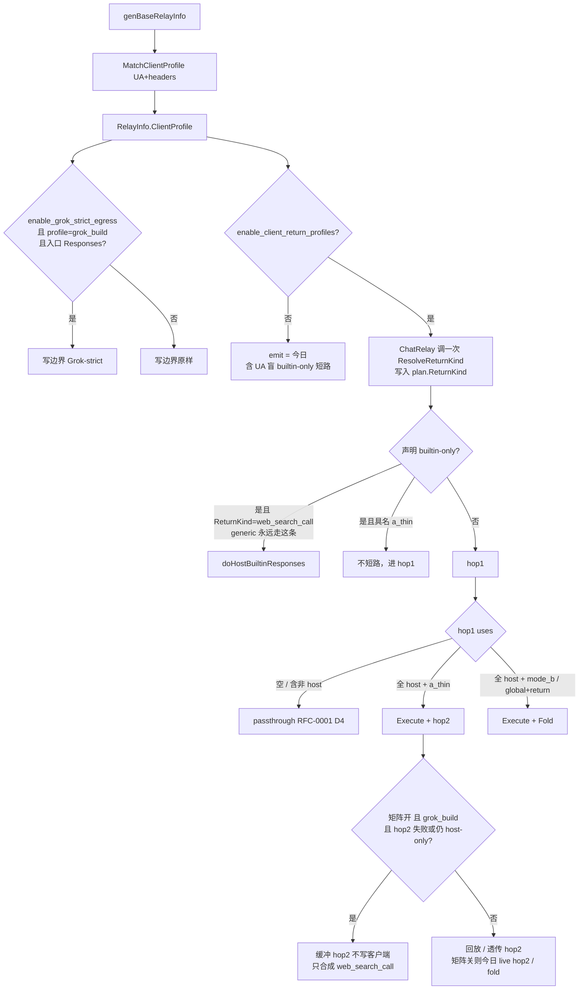

# RFC-0002：按 User-Agent 隔离 web_search 返回信息（ClientProfile）


| 字段       | 值                                                                                                                                                          |
| -------- | ---------------------------------------------------------------------------------------------------------------------------------------------------------- |
| **RFC**  | RFC-0002                                                                                                                                                   |
| **标题**   | 按 User-Agent 隔离 web_search 返回信息（ClientProfile emit / Grok-strict Responses / Claude-strict Messages）                                                         |
| **作者**   | 筱锋 / AI-assisted                                                                                                                                            |
| **日期**   | 2026-08-18                                                                                                                                                 |
| **状态**   | Draft                                                                                                                                                      |
| **文档类型** | 可评审 RFC（非实现）                                                                                                                                               |
| **最终路径** | [`docs/rfc/RFC-0002-client-profile-web-search-return.md`](docs/rfc/RFC-0002-client-profile-web-search-return.md)                                           |
| **前置文档** | [`docs/rfc/RFC-0001-bamboo-host-side-tools.md`](docs/rfc/RFC-0001-bamboo-host-side-tools.md)                                                               |
| **落地注记** | RFC-0001 文首已链到本文件。2026-08-18 补调研：Claude Code 2.1.88 sourcemap（`xiaolfeng/claude-code-sourcemap`）。                                                                 |
| **影响范围** | `/v1/responses` Grok-strict（UA 门控）；`/v1/messages` Claude-strict + helper 合成（UA 门控）；bamboo host-tool **回写形态**（矩阵开关，默认关）。`generic` emit 与今天一致。                      |


> **阅读约定**
>
> - **§ Key Decisions → v1 Locked** 是实现必须遵守的契约。
> - **三个独立开关**（两个 strict + 一个矩阵），禁止合成一个「既修解析器又改 generic」的默认 true flag。
> - **隔离原则**：某个 profile 的 emit patch **不得**落到其它 profile。Grok 补丁不得出现在 Claude Messages；Claude `server_tool_use` 不得出现在 Responses / OpenCode。
> - `relaykit/` 必须保持 `cd relaykit && GOWORK=off go build ./...` 独立可编译。**禁止**把 UA / Grok / Claude 客户端逻辑放进 `relaykit/`。
> - 对 RFC-0001 的修订集中在 **§ Amendments to RFC-0001**；未列入的 RFC-0001 锁定项保持有效。
> - **Q2 已关闭**（2026-08-18）：Grok v1 只发官方 `web_search_call`。
> - **Claude Code 软件 ≠ 模型**：模型能读任意 dump；软件的流式解析器会 **throw**，helper 只认 `server_tool_use` / `web_search_tool_result`。见 § Background「Claude Code 软件解析契约」。

---

## Overview

RFC-0001 把 host-tool 执行模型锁成**全局** `host_tool_mode`（`loop` = Mode A-thin，`return` = Mode B dump）。这对「网关代跑 WebSearch / WebFetch」够用，对「客户端软件看见什么」不够。

- Grok Build 读 `/v1/responses` 时，缺 `arguments` / `created` 会直接反序列化崩溃。
- Claude Code 读 `/v1/messages` 时，流式块类型对不上会 **throw**；`WebSearch` helper 只把 `server_tool_use` / `web_search_tool_result` 收成 hits。A-thin 文本模型能读，软件 UI 是「Did 0 searches」。
- Codex 要官方 Responses `web_search_call`，且不能被 Grok 的 `created` 别名污染。

本 RFC 引入一次解析、全程只读的 `ClientProfile`，并用 **三个独立 `*bool` 开关**：

| 开关 | 默认 | 做什么 | 不做什么 |
| --- | --- | --- | --- |
| `enable_grok_strict_egress` | **true**（键缺失 = true） | 仅 `grok_build` + Responses 写边界 | **不**改 Claude Messages / Codex / generic emit |
| `enable_claude_strict_egress` | **true**（键缺失 = true） | 仅 `claude_code` + Messages：流式类型门闩 + helper 合成 `server_tool_use` / `web_search_tool_result` | **不**改 Grok Responses；**不**往非 Claude 打 Anthropic server-tool |
| `enable_client_return_profiles` | **false**（键缺失 = false） | 具名 profile 的 `ReturnKind` 矩阵 | **不**改 `generic` 今日短路 |

全局 `host_tool_mode` **保留**。两套 strict 都挂 `relay/` 写边界 / host-tool 合成，**不进** `relaykit/`。`generic` 无论开关组合，emit 与今天一致。

---

## Background & Motivation

### 激励事故（Grok Build ≠「DeepSeek 坏了」）

Grok Build 在反序列化网关 `/v1/responses` 载荷时崩溃。运维日志：

- `serialization error: missing field arguments`
- 更早：`missing field created`

Grok 的 Responses 解析器是**严格**的：

1. 每个 `function_call` **必须**有 **string** `arguments`（即使是 `"{}"`）。不能缺字段，不能是 JSON object，不能用 Anthropic 风格 `input`。
2. 要求形状：

```json
{
  "type": "function_call",
  "id": "fc_...",
  "call_id": "call_...",
  "name": "read_file",
  "arguments": "{\"target_file\":\"foo.go\"}",
  "status": "completed"
}
```

3. 顶层必须有 `created`，或 Grok 认作等价的时间戳。官方 OpenAI Responses 字段是 `created_at`；Grok 已在缺 `created` 时失败。
4. 流式时，若**第一条** `function_call` 的 `response.output_item.added` 只有 `name`、没有 `arguments` 字符串，Grok **立刻**爆炸，不会等后续 chunk。
5. 打网关 `/v1/responses` 还出现过上游：`Bamboo / NewAPI：OpenAI Completions: Empty input messages`——该路径上 Responses `input` 没有变成 Chat `messages`。此字符串**不在本仓库**，是上游 Completions 拒空 `messages`。PR2 **不**声称修掉这条日志。
6. 即便 HTTP 200，tool-call 形状仍不完整。
7. 社区代理（如 AllApiDeck）的补丁：补 `id` / `call_id` / `name` / `status` / `arguments`；把 `input` 或 object 型 `arguments` 收成 JSON 字符串。
8. 运维结论：网关「支持 Responses」≠ Grok Build 能解析。要保住 `api_backend = "responses"`，**ai.x-lf.com 必须规范化**。否则只能退回 `chat_completions`。内置 web_search 依赖 Responses 路径，在网关修好之前是堵住的。

本设计必须让 Grok Build 的 Responses envelope 可解析，**并且**让 Claude Code **软件**能解析 Messages 工具块与 WebSearch helper 回包。两侧形状不得互串。

**PR2 不得在生产 UA 未知时宣称「合入后 Grok 不再崩溃」。** 见 Q1（PR2 发布门禁）与 §4.4。

### Claude Code 软件解析契约（源码已核实，2.1.88）

调研仓库：[`xiaolfeng/claude-code-sourcemap`](https://github.com/xiaolfeng/claude-code-sourcemap)（npm `@anthropic-ai/claude-code` 2.1.88，`cli.js.map` 还原）。下列路径相对 `restored-src/src/`。

**模型能读 ≠ 软件能解析。** A-thin / Mode B dump 模型可以当答案；崩的是进程内流式状态机，以及 `WebSearch` 客户端工具的结果折叠。

#### 识别

| 事实 | 位置 | 含义 |
| --- | --- | --- |
| Messages API `User-Agent` | `utils/http.ts:18–35` `getUserAgent()` | **`claude-cli/${VERSION} (${USER_TYPE}, ${CLAUDE_CODE_ENTRYPOINT ?? "cli"}…)`**。源码注释：**log filtering 依赖 `claude-cli` 子串，禁止改掉。** 现网 `parseClientSource` 的 `claude-cli` 能命中。 |
| 其它 UA | `utils/userAgent.ts`；`http.ts:37–49` | `claude-code/${VERSION}` 用于 MCP / 非 Messages。白名单须 **兼收** `claude-code/`。 |
| 稳定头 | `services/api/client.ts:105–108` | `x-app: cli`、`X-Claude-Code-Session-Id`。二次信号，**不是**身份。 |
| 自定义网关仍是 firstParty | `utils/model/providers.ts:6–14` | 未设 Bedrock/Vertex/Foundry 时 `getAPIProvider()==firstParty`。`ANTHROPIC_BASE_URL=ai.x-lf.com` **不会**关掉 WebSearch。 |
| WebSearch 启用条件 | `tools/WebSearchTool/WebSearchTool.ts:168–192` | firstParty / Foundry 全开；Vertex 仅 Claude 4+。打到本网关时工具是开的。 |

#### 两层请求（必须分开 emit）

`WebSearch` **不是**本地搜索。它是客户端 function，内部再打一枪要上游跑 Anthropic server-side 搜索：

| 层 | 谁发 | 声明 | 软件要看见什么 |
| --- | --- | --- | --- |
| **主循环** | REPL / agent | 普通 function，**名=`WebSearch`**（`tools/WebSearchTool/prompt.ts`） | 合法 Anthropic `tool_use`：`id` 非空；`input` 为 object 或 JSON **字符串**。软件随后跑 `WebSearchTool.call()`。 |
| **Helper** | `WebSearchTool.call()` | `extraToolSchemas: [{type:"web_search_20250305", name:"web_search", max_uses:8, …}]`，常规 `tools: []`（`WebSearchTool.ts:76–84, 254–291`） | **`server_tool_use` + `web_search_tool_result`**。`querySource: "web_search_tool"` **不在 HTTP 头上**。网关从 **入口 bytes 的 `tools[].type` 前缀 `web_search_`** 识别。用户消息 `Perform a web search for the query: …` 可作辅证，不得当唯一门闩。 |

`WebFetch`（`tools/WebFetchTool/`）是 **本地 HTTP + 小模型抽取**。主循环只要合法 `tool_use` 名=`WebFetch`、`input={url, prompt}`。A-thin 偷走后软件根本不会去 fetch。

#### 流式状态机（会 throw）

`services/api/claude.ts` 约 1995–2191 行：

| 条件 | 行为 |
| --- | --- |
| `content_block_start` 且 type=`tool_use` / `server_tool_use` | 把 `input` **改写成空字符串** `''`，准备吃 `input_json_delta` |
| `input_json_delta` 打在其它 type | **throw** `Content block is not a input_json block` |
| `input_json_delta` 时 `input` 已不是 string（start 带了完整 object 又来 delta） | **throw** `Content block input is not a string` |
| `text_delta` 打在非 `text` | **throw** |
| `thinking_delta` / `signature_delta` 打在非 `thinking` | **throw** |
| delta / stop 时该 index 没有 start | **throw** `RangeError: Content block not found` |
| `content_block_stop` 时尚无 `message_start` | **throw** `Message not found` |

合法两种写法，**禁止混用**：

1. **流式**：start 的 `input` 当空串 → 若干 `input_json_delta.partial_json` → stop。
2. **一次给齐**：start 带完整 object `input`，之后 **禁止**任何 `input_json_delta`。

`utils/messages.ts` `normalizeContentFromAPI`（2651–2750）：`tool_use.input` 必须是 string 或 object，否则 **throw**。string parse 失败不 throw，落到 `{}`，但 WebSearch 的 zod `query.min(2)` 会失败。

#### Helper 如何收成 UI

`makeOutputFromSearchResponse`（`WebSearchTool.ts:86–149`）**只看**：

- `server_tool_use`：跳过（切段落）
- `web_search_tool_result`：`content` 为数组则取每项 `title`+`url`；否则当错误读 `content.error_code`
- `text`：解说字符串

**不看** `tool_use` / `tool_result` / `web_search_call` / `[WebSearch] query=`。`getSearchSummary` 于是 `searchCount=0`，UI「Did 0 searches」（`UI.tsx:79–91`）。进度条依赖流式 `server_tool_use` 的 `input_json_delta` 里抠出 `"query"`，以及随后的 `web_search_tool_result`。

`Message.tsx` 对非 advisor 的 `server_tool_use` `logError` 后返回 null——主会话 **不**画官方搜索卡。搜索 chrome 全在 `WebSearchTool` render。主循环若被 A-thin 掉 `WebSearch` `tool_use`，软件 **不会**进 `call()`，helper 不会发生。

#### 对网关的推论

1. Matcher 继续收 `claude-cli`；加上 `claude-code/` 与 `X-Claude-Code-Session-Id`。
2. 主循环名=`WebSearch`/`WebFetch` 的 `tool_use`：Claude-strict 打开时 **passthrough**。
3. Helper（入口 `type` 前缀 `web_search_`）：host 执行后合成 `server_tool_use` + `web_search_tool_result`。
4. `claude_code` 的全部 `/v1/messages` 流式出口走 Claude-strict。不进 `relaykit/`。
5. 今日把 `web_search_20250305` 改写成 function 再 A-thin，软件稳定「Did 0 searches」。这是产品缺口。

### 当前状态（源码已核实，2026-08-18）

#### 客户端识别：今天只写日志，不改变中继

| 事实 | 位置 | 含义 |
| --- | --- | --- |
| UA / Originator 子串，大小写不敏感 | `model/log_summary.go` `parseClientSource` / `parseClientSourceFromHeaders` | 识别 Claude Code、Codex、OpenCode、ZCode、Cherry Studio、Cursor… |
| **Grok Build 未被识别** | 同上 switch；`chrome/` 会落到 `"Chrome"`（`:238–239`） | 真实 Grok UA 未抓包前，请求在日志里可能是空 / 浏览器 / 首段产品名 |
| 写入 `other.client_source` | `AppendLogDetailSummaries`、`model/log.go` | **只观测，不改 relay** |
| 开发者工具详情可见性 | `IsDeveloperToolLogSource` + `CanViewDeveloperToolLogDetail`（`model/log.go:166–169`） | `RoleCodeUser` 或管理员可见 Claude/Codex/OpenCode/ZCode 的 Record/FullLog |
| 渠道亲和已按 UA include 列表匹配 | `service/channel_affinity.go` `matchAnyIncludeFold`；规则在 `setting/operation_setting/channel_affinity_setting.go` | 选渠道 / 透传头，**不是** emit 契约 |

#### Host-tool 返回路径：RFC-0001 已落地，仍是全局模式

| 事实 | 位置 | 含义 |
| --- | --- | --- |
| 全局模式 | `setting/model_setting/bamboo_setting.go` `HostToolMode`（`loop` / `return`） | 非法值当 `loop` |
| Inspect / rewrite | `relay/bamboo/hosttool/inspect.go` `InspectAndRewrite` | 不读 UA |
| 执行决策 | `relay/bamboo/hosttool/loop.go` `DecideAction` → `passthrough` / `fold_b` / `hop2` | 看 **hop1 uses**，不是声明集。混合 uses → passthrough（RFC-0001 D4）。**无 User-Agent 分支** |
| 结果 dump | `relay/bamboo/hosttool/format.go` `FormatToolResult` | 全客户端同一文本 |
| Mode B 折叠 | `relay/bamboo/hosttool/fold.go` | 文本 dump；无 `web_search_call` / `function_call` |
| Builtin-only 短路 | `relay/bamboo/hosttool/builtin_only.go` `IsResponsesBuiltinOnly`；`relay/bamboo/bridge.go:141–144`；`relay/bamboo/host_relay.go` `doHostBuiltinResponses` | 注释写「Grok/Codex helper」，实现**只看** Responses + host-only **声明** |
| 合成出口 | `relay/bamboo/hosttool/responses_call.go` `MarshalBuiltinComplete` / `BuiltinStreamFrames` | 官方风格 `web_search_call`；只有 `created_at`，**没有** `created`；帧是完整 `event:\ndata:\n\n` |
| 流式 hop2 | `doHostStreamRelay`（`host_relay.go:245–257`） | hop2 `writeLive=true`，**之后**才检查 hop2 是否仍 host-only 再 fold |
| Plan | `relay/common/host_tool_plan.go`（`Mode`、`BuiltinResponses`） | 无 profile 字段 |

RFC-0001 §6.4 客户端契约表是 **Mode-B-only**，并明确 Codex/Responses 收文本、**不是**官方 `web_search_call`。Builtin-only 短路后来否定了这张表。本 RFC 把该例外写成 **UA 显式 erratum**（仅 `codex` / `grok_build`；`generic` 保持今日短路）。

#### Responses DTO / 转换：事故的吸烟枪

| 事实 | 位置 | 对 Grok 的后果 |
| --- | --- | --- |
| 顶层只有 `created_at` | `relaykit/dto/openai_response.go` `OpenAIResponsesResponse.CreatedAt` `json:"created_at"` | **没有** `created` 字段 |
| `arguments` 带 `omitempty` | `ResponsesOutput.Arguments` 是 `json.RawMessage` `json:"arguments,omitempty"` | nil / 空 → **字段被省略** → `missing field arguments` |
| Chat 完成态转换 | `relaykit/relayconvert/internal/oai_chat/to_oai_responses_resp.go` `chatToolCallToResponsesOutput` | `chatArgumentsRawMessage`：空字符串 marshal 成 `""`（JSON 空串，不是 `"{}"`） |
| Chat 流式转换（relaykit） | `.../to_oai_responses_stream_resp.go` `appendToolCallDelta` | 首个 `output_item.added` 设 `Arguments: []byte(`""`)`。至少字段还在 |
| **原生 Chat→Responses 流** | `relay/channel/openai/chat_to_responses_stream.go:437–446` | 首个 `function_call` 的 `output_item.added` **根本不设 Arguments**。加上 DTO `omitempty`，这就是「第一帧只有 name」的崩溃点 |
| Gemini→Responses | `relay/channel/gemini/relay_responses.go` `GeminiResponsesHandler:74–78` / `GeminiResponsesStreamHandler:98–105` | 走同一套 relaykit 转换 + `IOCopyBytesGracefully` / `ResponseChunkData` |
| Responses→Chat 入站 | `relaykit/relayconvert/internal/oai_responses/to_oai_chat_req.go` `responsesRequestMessagesToChat` | `Input` 缺省 → 可能空 `[]Message` → 上游 Completions `Empty input messages` |
| Helper | `relay/responses_handler.go` | bamboo `ChatRelay`、`originalResponsesRelay`、`responsesViaChatCompletions` |

**`relaykit` 必须保持独立可构建。禁止把 Grok / UA 逻辑放进 `relaykit/`。** 空串 `""` 对非 Grok 客户端必须保持原样（测试 D7.5）。

#### 其它硬约束（AGENTS.md）

- JSON 只走 `common.Marshal` / `common.Unmarshal`。
- SQLite / MySQL / PostgreSQL；v1 **无新表**（与 RFC-0001 D15 一致，options-only）。
- 不修改 new-api / QuantumNous 品牌。
- 计费不变量不变：host-tool 加价仍走 `BuiltInTools` / `collectToolSurchargeItem`；fold / dump 文本不得计入 completion tokens；成功 search 仍由 `execute.go` `shouldBillHostResult` + `incrementHostToolBilling` 计次。
- Host-tool 执行留在 `relay/bamboo/hosttool/`，Plan 类型留在 `relay/common`。不要把执行放进 `relaykit/`。

### 痛点

1. **一个全局 mode 无法同时满足两套客户端可见形状。** Claude 看见 `web_search_call` / 双时间戳会乱；Grok 看见 Mode B dump 或残缺 `function_call` 会崩。
2. **「支持 Responses」被理解成协议完整。** 现网 DTO 按官方 OpenAI 建模，Grok 按更严的超集解析。
3. **Builtin-only 短路是隐式 UA。** 注释写 Grok/Codex，代码对所有 Responses host-only 生效。本 RFC **不**用矩阵去改 `generic` 这条现网路径。
4. **修补若做成全局 normalize，会把 Grok 字段泄漏给 Codex / 官方 SDK。**

---

## Goals & Non-Goals

### Goals

1. 每个请求从 User-Agent + 已知头解析一次 `ClientProfile`，挂到 `RelayInfo`，bamboo / hosttool / Responses 出口只读。
2. **返回信息隔离**同时覆盖：(a) 协议形状；(b) 载荷内容。
3. `grok_build` 在全部 `/v1/responses` 出口走 Grok-strict。以生产 UA 抓包为 PR2 发布门禁。
4. `claude_code` 在全部 `/v1/messages` 出口走 Claude-strict；WebSearch **helper** 合成 Anthropic `server_tool_use` + `web_search_tool_result`。主循环 `WebSearch`/`WebFetch` `tool_use` 在 Claude-strict 打开时 passthrough。
5. 矩阵打开后：OpenCode / ZCode 强制 A-thin；Codex / Grok builtin-only 走官方 `web_search_call`（Codex **不加** `created`）。**`generic` 无论开关都保持今日短路 / 今日 `host_tool_mode`。**
6. **未匹配 UA（`generic`）emit 与今天逐字节一致。** 默认配置下，具名 profile 除 UA 门控的 *strict egress*（Grok 信封、Claude 流式类型 + helper 合成）外 emit 不变。
6. 无新表；计费与 SSRF 不改。
7. 可观测：`client_profile` merge 进 `admin_info`；补字段 / 疑似漏匹配 UA 打 **请求级** warn。`return_profile` 仅在矩阵 PR 写入，避免长期 `""`。

### Non-Goals

- 替换或废除 `host_tool_mode`。
- 用 UA 做鉴权、选渠道、改 quota / 计费身份。
- 在 `relaykit/` 内改 DTO 标签或转换器。
- 完整重写 Responses 历史 item。RFC-0001 §7 仍延期；见 PR5。
- 无界 ReAct、改 SSRF、改搜索后端、改 FormatToolResult 文本语法。
- 在 v1 **同时**往线上打 `web_search_call` 与名为 `web_search` 的 `function_call`（Q2 已关：只发官方 `web_search_call`）。
- 用矩阵关掉 `generic` 的今日 builtin-only 短路。
- 把 Claude helper 合成打进 Responses / 把 Grok `created` 打进 Messages。
- 实现生产代码（本文只做 RFC）。

---

## Key Decisions

### v1 Locked


| #   | 决策 | 锁定值 | 理由 |
| --- | --- | --- | --- |
| D1  | 客户端模型 | **`ClientProfile`，不是新的全局 mode**。一次解析，挂 `RelayInfo`。**不**替换 `host_tool_mode` | 全局 mode 无法隔离 |
| D2  | 隔离原则 | **一个 profile 的 emit patch 不得应用于任何其它 profile** | Grok-strict / 双时间戳 / 首帧 `"{}"` **只** `grok_build`。`server_tool_use` / `web_search_tool_result` **只** `claude_code` Messages |
| D3  | 返回信息矩阵 | §3 两张表：**(1) 声明分类 → 是否 builtin-only 短路**；**(2) hop1 uses → `DecideAction`**。协议形状和载荷都隔离 | 「混合」不得再写成 A-thin 执行 |
| D4  | Grok-strict 出口 | **写边界 post-process**，在 `relay/`，**不在** `relaykit/`。对 `grok_build` 的 **全部** `RelayModeResponses` 对话出口生效。由 `enable_grok_strict_egress` 门控，**不**由矩阵开关门控 | 事故里的 `read_file` 来自转换后的 Chat tool_call |
| D5  | Empty input messages | **相邻 bug，默认另 PR**。Builtin-only 短路不打 Completions。PR2 **不**修这条上游日志 | RFC-0001 §7 已延期 |
| D6  | 配置 | 无新表。两个 `*bool` + 可选 override map。未知 UA → `generic` → **今日 emit** | 热更新；options-only |
| D7  | 测试 | § Testing；testify `require`/`assert` | 隔离必须有金样 |
| D8  | 可观测 | `client_source` 保留；`client_profile` merge 进 `admin_info`；补字段与漏匹配 UA 请求级 warn | 与 RFC-0001 admin_info merge 同一模式 |
| D9  | Matcher 位置 | **一份**共享 matcher（`common/client_profile.go`） | `model`→`relay/common` 已存在，matcher 放 `model` 会环 |
| D10 | Builtin-only 短路 | **矩阵关**：今日行为（所有 Responses host-only 声明都短路）。**矩阵开**：仅具名 profile 改短路策略；**`generic` 仍走今日短路**（`IsResponsesBuiltinOnly` 为真则 `doHostBuiltinResponses`）。**override 不得推翻本条**：`generic && builtinOnly` 在 override 之后强制 `web_search_call` | 未匹配 UA 零变化；`host_tool_client_profiles.generic=a_thin` 是运维误触，必须忽略 |
| D11 | Grok 永不 Mode B dump | **仅当 `ClientReturnProfilesEnabled()`**：`grok_build` 即使 override / `host_tool_mode=return` / hop2 额度门失败 / hop2 仍 host-only，也 **不得** 把 `FormatToolResult` 当主答案。host-only 结果改为官方 `web_search_call`。在 override 解析之后强制执行。**矩阵关：今日 fold / `return` / 额度门降级，不改 emit** | Mode B dump 不是 Responses web_search 结果。矩阵默认关，不得悄悄改 Grok 流式延迟 |
| D12 | 不发明 `function_call` 包一层 | builtin-only / host-only 成功路径**只发** OpenAI 官方 `web_search_call`（`action.query` + `sources[]`）。**不**包一层名为 `web_search` 的 `function_call`。**不**在同一响应打两种形状。产品已关 Q2（2026-08-18） | 官方形状；helper 若不认，另开一小 PR / override，不在 v1 猜两种 |
| D13 | hop2 预置 host tool_use | **仅当 `ClientReturnProfilesEnabled()`**：Responses 入口 +（`grok_build` \| `codex`）**禁止** `prependHostToolCalls` / `emitHostToolCalls`。**矩阵关：保持今日 prepend/emit** | 否则 Grok 会当本地工具再跑。矩阵关必须与今天逐字节一致（除 Grok-strict 信封） |
| D14 | UA 不是身份 | spoof UA 只能改变 **响应形状** | 威胁模型 T-UA |
| D15 | 三开关 | `enable_grok_strict_egress` 默认 **true**；`enable_claude_strict_egress` 默认 **true**；`enable_client_return_profiles` 默认 **false**。三者皆 `*bool`，缺键=默认。关矩阵 **不**关任一侧 strict | Grok 崩信封、Claude 崩流式/helper，都与矩阵无关 |
| D16 | 格式门闩 + 无条件调用 | `ShouldNormalizeResponses` **必须**要求入口 `RelayFormatOpenAIResponses`。`writeSSE` 包装在 entry codec 不是 Responses 时是 no-op。**§4.3 每个钩子无条件调用对应 helper**；helper 对 generic 只观测、只在 `ShouldNormalizeResponses` 时 mutation。调用方 **禁止** `if ShouldNormalizeResponses { Normalize* }` | 防止 spoof-UA 的 Claude 流被注入 `created`；漏匹配 warn 必须看见 generic |
| D17 | hop1 混合 uses | **所有 profile（含 `grok_build`）** 保持 RFC-0001 D4：hop1 uses 既有 host 又有非 host → passthrough，不执行 | 网关不能代跑 `bash` |
| D18 | 流式 D11 | **仅当 `ClientReturnProfilesEnabled()`**：`grok_build` 走 hop2 且可能 D11 回退时 hop2 `writeLive=false` 缓冲。非 host-only 则回放；仍 host-only / 额度门失败则只合成 builtin 帧。修订 RFC-0001 D16 **仅** `grok_build`；**仍无 hop3**。**矩阵关：hop2 保持今日 `writeLive=true`** | 避免先写出 hop2 `function_call` 再追加 `web_search_call`。矩阵关不得改变「hop2 开始出 token」的延迟 |
| D19 | Claude-strict Messages | **写边界**，`relay/`，**不在** `relaykit/`。仅 `enable_claude_strict_egress && claude_code && RelayFormatClaude`。规则见 §5。入口不是 Messages 时 no-op | 2.1.88 流式状态机对类型不匹配 **throw**，会杀掉整轮 |
| D20 | Claude WebSearch helper 合成 | `IsClaudeWebSearchHelper(entryBytes)`（扫入口 `tools[].type` 前缀 `web_search_`，且无非 host 工具）为真时：host 执行，**禁止 hop2**，合成 `server_tool_use` + `web_search_tool_result`。由 `enable_claude_strict_egress` 门控，**不**等矩阵 | helper 只认这两种块；A-thin / `web_search_call` / 普通 `tool_use` → UI「Did 0 searches」 |
| D21 | 主循环 WebSearch/WebFetch 不偷 | **仅当 `ClaudeStrictEgressEnabled()`**：hop1 uses **全部**是名=`WebSearch`/`WebFetch` 的客户端 function → **passthrough**，让软件 `call()`。随后 helper 走 D20。混有 `bash` 等仍 D4。**Claude-strict 关：今日 A-thin/fold** | 官方路径是客户端工具再打 helper。A-thin 偷走后 helper 永不发生 |


---

## Amendments to RFC-0001

本 RFC **修订**下列 RFC-0001 项。未列出的锁定项（尤其 D2 A-thin 仍是 `host_tool_mode=loop` / generic 默认、**禁止 hop3**、§7 历史 skip 仍延期、D15 无新表、D1 原生三段式不执行 host-tool、执行仍在 `relay/bamboo/hosttool`）**保持不变**。


| RFC-0001 | 本 RFC 修订 | 理由 |
| --- | --- | --- |
| **Alt-6**（否决「按 UA 自动选 A/B」） | **反转**：具名 ClientProfile 成为 emit 开关。**仅**在 `enable_client_return_profiles=true` 时生效；`generic` 不参与隐式改道 | 事故证明「一个全局 mode + 隐式短路」已经在用未声明的客户端假设。显式 UA 表 + 默认关矩阵，比继续假装 UA 不存在更安全。探测仍脆，所以白名单保守，且 Q1 是 PR2 门禁 |
| **D3 / Mode B 逃生舱** | **仅矩阵打开后**，具名 Agent（`claude_code` / `opencode` / `zcode` / `grok_build`）**不再**因 `host_tool_mode=return` 而吃 Mode B dump。新的运营后门是 `host_tool_client_profiles`（**不可**用它改 `generic` 的 builtin-only 短路）。矩阵关时 `generic` 与具名 profile 仍可用全局 `return` | Mode B 不是这些 Agent 的官方体验；Grok 吃 dump 会当最终答案或解析失败。矩阵默认关，不得悄悄改今日 fold |
| **D16** | **仅矩阵打开后的 `grok_build`**：hop2 仍 host-only / 额度门失败 → 合成 `web_search_call`，不是 Mode B fold。流式必须先缓冲 hop2。**仍禁止 hop3**。矩阵关 = 今日 D16（fold，live hop2） | 与本 RFC D11 / D18 一致 |
| **§6.4** | **勘误**：Codex / Grok builtin-only 的现网出口已是 `web_search_call`（`doHostBuiltinResponses`），不是 §6.4 写的「只有文本」。本 RFC 把该例外冻结为 `codex` + `grok_build`（及矩阵关时的全体 Responses host-only，即今日行为）。Claude **不**走 `web_search_call` | 承认后补短路 |
| **D2 A-thin（仅 Claude WebSearch/WebFetch）** | **仅当 `ClaudeStrictEgressEnabled()`**：主循环这两把客户端 function **passthrough**，不 A-thin。Helper 另走 D20 合成。其它 host 工具 / 其它 profile 仍 A-thin | 2.1.88 官方路径是客户端再打 helper；A-thin 偷走后软件无搜索 UI |


Grok-strict 作用在 `originalResponsesRelay` 的 adaptor `DoResponse` 上，只改写出字节，**不**在原生三段式里执行 host-tool，不违反 RFC-0001 D1。

---

## Proposed Design

### 1. ClientProfile 解析（D1 / D9）

在 `common/client_profile.go` 新增（`model` 与 `relay` 都已依赖 `common`，无新环）。**禁止**把 matcher 放进 `model`（`model/task.go` 已 import `relay/common`，`genBaseRelayInfo` 再调 `model` 会环）。**禁止**放进 `relay/common`（日志层不应依赖 relay 类型）。渠道亲和继续独立（D14）。

```go
package common

type ClientProfile string

const (
    ClientProfileGrokBuild  ClientProfile = "grok_build"
    ClientProfileClaudeCode ClientProfile = "claude_code"
    ClientProfileCodex      ClientProfile = "codex"
    ClientProfileOpenCode   ClientProfile = "opencode"
    ClientProfileZCode      ClientProfile = "zcode"
    ClientProfileGeneric    ClientProfile = "generic"
)

type ClientIdentity struct {
    Profile ClientProfile
    Source  string // 必须与现网日志展示名逐字相同，见下表
    Hit     string // 命中的 token 或头名，仅 admin
}

func MatchClientProfile(userAgent string, headers map[string]string) ClientIdentity
```

**解析顺序（锁定）：**

1. 头 `x-grok-client-identifier`（大小写不敏感）非空 → `grok_build`（`Hit=x-grok-client-identifier`）。
2. UA；若 UA 空则回退 `Originator`（对齐今天 `parseClientSourceFromHeaders`）。
3. UA 折叠为 lower，按 **具名 Agent 白名单** 匹配。**必须在** 现有 `chrome/` / `firefox/` / `safari/` 分支之前。
4. 未命中 → `generic`（`Source` 仍由遗留浏览器/语言表填写；emit 当 generic）。

**具名白名单与日志展示名（`Source` 字符串锁定，供 `log_summary_test.go`）：**


| Profile | UA 子串（lower，`strings.Contains`） | 额外头 | `Source`（禁止改字） |
| --- | --- | --- | --- |
| `grok_build` | `grok-cli`、`grok-build`、`grok-pager`、`grok-tui`、或 `grok/`；**外加 Q1 抓到的生产 token** | `x-grok-client-identifier` | `Grok Build` |
| `claude_code` | `claude-cli`、`claudecode`、`claude-code/` | 辅：`X-Claude-Code-Session-Id` 非空，或 `x-app` 大小写不敏感等于 `cli`（**不得**单独当命中：其它客户端也可能带 `x-app`）。优先 UA | `Claude Code` |
| `codex` | `codex_cli_rs`、`codex-cli-rs`、`codex_vscode`、`codex-tui`、`codex-desktop`、`codex desktop` | — | `Codex` |
| `opencode` | `opencode/`、`crush/` | — | `OpenCode` |
| `zcode` | `zcode/` | — | `ZCode` |
| `generic` | 其它一切（含 `chrome/`、`curl/`、Cherry、Cursor） | — | 保持现有 `parseClientSource` 结果 |

**禁止**用裸 `grok` 子串。`Mozilla/5.0 ... Chrome/120.0` → **不是** `grok_build`。

`model/log_summary.go`：`parseClientSourceFromHeaders` 先调 `MatchClientProfile`；具名 profile 返回上表 `Source`；否则走现有浏览器/语言 switch，并 **删掉** 会与白名单重复的 claude/codex/opencode/zcode 分支。`MatchClientProfile` + `parseClientSourceFromHeaders` 必须表测覆盖现有全部具名 Agent 夹具。

`IsDeveloperToolLogSource` 增加 `"Grok Build"`。这是**有意的可见性变化**：一旦 UA 被识别，`RoleCodeUser`（以及管理员）可以像看 Claude Code 一样看到 Grok Build 的 `Record` / `FullLog`（`model/log.go:166–169`）。普通 `RoleCommonUser` 仍看不到详情。PR1 测试锁住这一点。

`relay/common/relay_info.go` `RelayInfo` 增加（`genBaseRelayInfo` 赋值一次）：

```go
ClientProfile    common.ClientProfile
ClientSource     string
ClientProfileHit string
// 写边界 / 观测（每请求一次）
EgressFilledArgs     bool
EgressFilledCreated  bool
EgressMissedUAWarned bool
EgressCreatedAt      int64 // 本请求统一时间戳；0 则首次填充为 info.StartTime.Unix()
```

`HostToolPlan.ReturnProfile` / `ReturnKind` **不要在 PR1 预留并写入日志**。它们在 PR3 与 `ResolveReturnKind` 一起落地。PR1 的 `admin_info` 只 merge `client_profile` / `client_profile_hit`。



### 2. 隔离原则（D2）——产品

**返回信息隔离 = 协议形状 + 载荷内容。** 禁止出现：

- Claude / OpenCode 响应里出现 `web_search_call`、`created` 别名、Grok 填的 `arguments:"{}"`。
- Grok / Codex / OpenCode 响应里出现 `server_tool_use` / `web_search_tool_result`。
- Grok 把 Mode B 的 `[WebSearch] query=...` dump 当成 Responses web_search 主答案。
- Codex 响应里出现 `created`（PR2 就必须有泄漏金样）。
- 把任一侧写边界补丁注册成格式无关的全局中间件。
- Claude helper 合成与 Grok `web_search_call` 打在同一条响应。

同一份 `ExecResult` 在三个 profile 下必须变成 **三种** 线上字节（测试 2，PR4）。PR2 至少锁住 Codex vs Grok 的 envelope 差。

### 3. web_search 返回信息矩阵（D3 / D10 / D11 / D12 / D17）

`ReturnKind` 取值：

| `ReturnKind` | 含义 |
| --- | --- |
| `web_search_call` | 网关执行后走 `doHostBuiltinResponses` / `MarshalBuiltinComplete`；或 D11 回退合成同一形状 |
| `anthropic_server_search` | 网关执行后合成 Anthropic `server_tool_use` + `web_search_tool_result`（§5.2）。**只** `claude_code` helper |
| `a_thin` | RFC-0001 Mode A-thin：执行 + hop2；客户端看见最后一跳文本或非 host `tool_use` |
| `mode_b` | RFC-0001 Mode B：`FoldResponse` + `FormatToolResult` 文本 |
| `passthrough_client` | 不执行 host；把 hop1 `tool_use` 原样回给客户端（D21） |
| `global` | 跟随 `host_tool_mode`（`loop`→`a_thin`，`return`→`mode_b`） |

`IsResponsesBuiltinOnly` **保持纯函数**（格式 + **声明**，不读 UA）。

#### 3.1 表 A — 请求声明分类（是否短路，与 hop1 uses 无关）

仅当 `plan.Enabled && IsResponsesBuiltinOnly(...)`。


| Profile | 矩阵 **关**（默认） | 矩阵 **开** |
| --- | --- | --- |
| `grok_build` | 今日：短路 `web_search_call` | 短路 `web_search_call`，无 hop2 |
| `codex` | 今日：短路 | 短路 `web_search_call` |
| `claude_code` | 今日：若打 Responses 且只声明 builtin，也会短路（少见） | **不**走 Responses `web_search_call`。Messages helper 见 D20，不在本表 |
| `opencode` / `zcode` | 今日：若打 Responses 且只声明 builtin，也会短路 | **A-thin**（不短路，进 hop1） |
| `generic`（未匹配 UA） | 今日：短路 | **仍短路**（与今天相同） |

#### 3.2 表 B — hop1 `DecideAction`（uses，不是声明）

| hop1 uses | 所有 profile（含 `grok_build`） |
| --- | --- |
| 无 `tool_use` | `passthrough` |
| **任一非 host**（例如 `bash` / `read_file` 与 host 搜索同时出现） | **`passthrough`，不执行。RFC-0001 D4，本 RFC D17。禁止读成 A-thin。** |
| 全部 host | 见表 C |

#### 3.3 表 C — hop1 全是 host uses 时的 emit（矩阵开；矩阵关则只看 `plan.Mode`）


| Profile | 全 host uses | 客户端可见信息 |
| --- | --- | --- |
| `grok_build` | `a_thin`（hop2）。**忽略** `return` / override `mode_b`（D11 在 override 之后强制，**且仅矩阵开**）。hop2 额度门失败或 hop2 仍全 host → 合成 `web_search_call`，禁止 `FoldResponse` | 官方 `web_search_call`（`action.query` + `sources[]`）或 hop2 综合 / 非 host tool。任何 `function_call` 必须 Grok-strict。Envelope：`created_at` **+** `created`。**不要** dump |
| `claude_code` | 仅 WebSearch/WebFetch 客户端 function 且 Claude-strict 开 → `passthrough_client`。其它全 host → `a_thin` | 主循环：官方 `tool_use`（软件自己 `call()`）。Helper：§5.2。无 `web_search_call`、无 `created` |
| `opencode` / `zcode` | 强制 `a_thin` | 最后一跳文本。无 `web_search_call`。无 Grok 字段。无 `server_tool_use` |
| `codex` | `a_thin`（builtin-only 已在表 A 短路） | 官方 `web_search_call` 仅来自表 A；此处无 `created` 别名 |
| `generic` | `global` → 今日 `plan.Mode` | 与今天相同（含 Mode B dump） |

矩阵关时不调用 `ResolveReturnKind` 做分支，`DecideAction` 保持今天只读 `plan.Mode`。

#### 3.4 `ResolveReturnKind`：锁定签名 + 唯一调用点

```go
// relay/clientprofile/resolve.go
// builtinOnly = hosttool.IsResponsesBuiltinOnly(...) 的结果。
// 不接收 *HostToolPlan，不区分 mixed uses（那是 DecideAction / D17）。
func ResolveReturnKind(profile common.ClientProfile, builtinOnly bool, st *model_setting.BambooSettings) string
```

**唯一调用点：** `relay/bamboo/bridge.go` `ChatRelay`，在 `InspectAndRewrite` **之后**、短路 / `DecideAction` **之前**：

```text
if info.HostToolPlan != nil && st.ClientReturnProfilesEnabled() {
    builtinOnly := hosttool.IsResponsesBuiltinOnly(entryFormat, requestBody, info.HostToolPlan, relayReq)
    info.HostToolPlan.ReturnProfile = string(info.ClientProfile)
    info.HostToolPlan.ReturnKind = clientprofile.ResolveReturnKind(info.ClientProfile, builtinOnly, st)
}
```

`DecideAction`（`loop.go`，由 `host_relay.go` 调用）**只读** `plan.ReturnKind` / `plan.Mode`，不再自己算 profile。`InspectAndRewrite` 若分配新 `HostToolPlan`，调用方必须在 inspect 返回值上写 `ReturnKind`，不要先拷一份再丢。

算法（矩阵开）：

```text
kind = hardcoded(profile, builtinOnly)   // 表 A/C
if override := st.HostToolClientProfiles[string(profile)]; override 合法 {
    kind = override
}
// D11 在 override 之后（仅 grok_build；本函数只在矩阵开时被调用）：
if profile == grok_build && (kind == "mode_b" || (kind == "global" && st.ResolvedHostToolMode() == "return")) {
    logger.LogWarn(... ignored grok override ...)
    if builtinOnly { kind = "web_search_call" } else { kind = "a_thin" }
}
// D10 在 override **和** D11 之后：generic 不得被改道
if profile == generic && builtinOnly {
    if kind != "web_search_call" {
        logger.LogWarn(... ignored generic override ...)
    }
    kind = "web_search_call"
}
return kind
```

`hardcoded`：`generic`+`builtinOnly` → `web_search_call`；`generic`+!builtinOnly → `global`；`grok_build`/`codex`+builtinOnly → `web_search_call`；其余具名 → `a_thin`。

`generic && !builtinOnly` 的 override（例如 `mode_b`）**可以**保留：那只影响「声明里还有 agent 工具、hop1 全是 host uses」的 generic，与今日 `host_tool_mode` 逃生舱同类，不破坏 D10 的 builtin-only 短路。**禁止**用 override 让 generic Responses host-only 声明走 A-thin / Mode B。

短路门闩（`ChatRelay`）：

```text
builtinOnly = IsResponsesBuiltinOnly(...)
if builtinOnly && plan.Enabled {
    if !st.ClientReturnProfilesEnabled() {
        // 今日：所有人短路
        plan.BuiltinResponses = true
        return doHostBuiltinResponses(...)
    }
    if plan.ReturnKind == "web_search_call" {
        // 矩阵开：generic / grok_build / codex（及 override）
        plan.BuiltinResponses = true
        return doHostBuiltinResponses(...)
    }
    // 矩阵开 + 具名 a_thin（Claude-on-Responses）：不短路
}
```

#### 3.5 流式 D11（修订 RFC-0001 D16，仅矩阵开时的 `grok_build`）

**矩阵关（默认）：** hop2 `writeLive=true`；额度门失败 / hop2 仍 host-only → 今日 `FoldResponse` / `emitFoldedStream`；`prependHostToolCalls` / `emitHostToolCalls` 保持今日。Grok-strict 仍只改信封（若 UA 命中）。

**矩阵开** 且 `ClientProfile==grok_build`：

非流：hop2 后若仍全 host / 额度门失败 → 不要 `FoldResponse`；`[]ExecResult` 交给 `MarshalBuiltinComplete`，再走 `NormalizeResponsesPayload`。

流式：今日 `doHostStreamRelay` 对 hop2 `writeLive=true`，客户端已经看到 hop2 的 `function_call`，再 `BuiltinStreamFrames` 会**双写**。因此：

1. 当本轮已执行 host（即将 hop2，或额度门可能失败）时，hop2 使用与 hop1 相同的 **`writeLive=false` 缓冲**。
2. hop2 结束后：
   - uses 含非 host，或纯文本：把缓冲帧按原序回放（可再走 `NormalizeResponsesSSEFrame`）。
   - 仍全 host，或额度门未过：丢弃 hop2 缓冲；执行（若尚未执行）后只写 `BuiltinStreamFrames`，每帧走 **`NormalizeResponsesSSEFrame`**。
3. **禁止 hop3。** 已写 SSE 头则不得改回 JSON。
4. 必须有流式金样：缓冲 hop2 的 host-only `function_call` **不得**出现在客户端字节里；只出现 `web_search_call` 合成帧。
5. 矩阵关的对照金样：同一 `grok_build` 请求 hop2 仍 live，失败路径仍是 fold dump（外加 Grok-strict 信封，若适用）。

#### 3.6 载荷内容（同一 ExecResult）

| kind | 客户端正文 |
| --- | --- |
| `web_search_call` | `action.type=search`，`action.query`，`action.sources[].{type:url,url,title}`。fetch：`action.type=open_page` + url/pattern。**不含** `[WebSearch] query=`，**不含** fetch Body 全文 |
| `a_thin` | hop2 模型综合文本；host 结果只在 hop2 请求的 `tool_result` |
| `mode_b` | `FormatToolResult` 文本 |

### 4. Grok-strict Responses 出口规范化（D4 / D16）

**位置（锁定）：** `relay/clientprofile/`。**禁止**改 `relaykit/dto` 的 `omitempty`。

**作用域：** mutation 仅当 `ShouldNormalizeResponses` 为真。Chat Completions 出口、`/v1/messages`、Gemini generateContent **不改字节**。漏匹配观测在 helper 内对 generic Responses 入口始终跑。

**不要**把 `web_search_call` 包成假 `function_call`。仍要给 `object=="response"` 的 envelope 补时间戳。

#### 4.1 三个 helper（锁定；禁止「无法解析就原样返回」时误吞完整 SSE 帧）

```go
// relay/clientprofile/normalize.go

// 1) 非流 JSON body（OaiResponsesHandler / OaiChatToResponsesHandler /
//    ChatCompletionsToResponsesHandler / GeminiResponsesHandler /
//    writeCompleteResponse / MarshalBuiltinComplete）
func NormalizeResponsesPayload(info *relaycommon.RelayInfo, payload []byte) []byte

// 2) 单条 data: 的 JSON 对象（sendEvent / sendResponsesStreamData /
//    GeminiResponsesStreamHandler.sendEvent / OaiChatToResponsesStreamHandler）
func NormalizeResponsesSSEData(info *relaycommon.RelayInfo, data []byte) []byte

// 3) 完整 SSE 帧（可能含 event: / data: / 注释 / ping）。
//    用 bamboorelay.SplitSSEFrames（或等价拆分）切开；
//    只对 JSON data 行走与 (2) 相同的 walker；
//    非 JSON（`: ping`、`: keep-alive`、serializer ping）必须字节级不变；
//    再按原分隔重装。
func NormalizeResponsesSSEFrame(info *relaycommon.RelayInfo, frame []byte) []byte

func ShouldNormalizeResponses(info *relaycommon.RelayInfo) bool
```

`ShouldNormalizeResponses`（锁定，**只决定 mutation**，不决定是否调用 helper）：

```text
info != nil
&& model_setting.GetBambooSettings().GrokStrictEgressEnabled()
&& info.ClientProfile == grok_build
&& info.RelayFormat == types.RelayFormatOpenAIResponses
```

**调用契约（锁定，禁止写错）：**

```go
// 正确：§4.3 每个钩子无条件调用
body = clientprofile.NormalizeResponsesPayload(info, body)

// 错误：调用方预判 ShouldNormalizeResponses
// 这会让 generic 永远进不了漏匹配观测
if clientprofile.ShouldNormalizeResponses(info) {
    body = clientprofile.NormalizeResponsesPayload(info, body)
}
```

三个 helper 内部顺序（锁定）：

1. `RelayFormat != OpenAIResponses`（或 helper 3 的 entry codec 不是 Responses）→ 原样返回，不解析。
2. 解析 JSON（helper 3 只解析 data 行）。失败 → 原样返回。
3. **漏匹配观测**（不 mutation）：`profile==generic` 且出现「`function_call` 缺 `arguments`」或「`object==response` 既无 `created` 也无 `created_at`」→ 若尚未 `EgressMissedUAWarned`，`LogWarn` 一次并置位。
4. **仅当** `ShouldNormalizeResponses` → 跑 §4.2 walker；有 mutation 才 remash。
5. 否则返回原始 `[]byte`。

helper 文件头注释必须写明「调用方禁止预判 `ShouldNormalizeResponses`」。测试 14 覆盖：generic + 缺 `arguments` 经 **无条件** helper 调用后正好一条 warn、字节不变。另加负例注释测试或 linter 说明：预判门闩会使 Test 14 失败。

正在「写 Responses SSE/JSON」但 `RelayFormat` 尚未被标成 Responses 的路径（不应存在；`GenRelayInfoResponses` 已设）不得放宽启发式。`writeSSE` 包装额外要求 `entryCodec.Format() == FormatOpenAIResponses`；否则 **no-op**（仍是函数调用，内部第一步直接返回）。

测试（PR2）：`ClientProfile=grok_build` + `/v1/messages`（`RelayFormatClaude`）写出字节与今天 **逐字节相同**。

`BuiltinStreamFrames` 的每一帧 **必须**走 helper 3，禁止把完整 `event: response.created\ndata: {...}\n\n` 丢给 helper 1/2（Unmarshal 会失败并原样返回，事故里的 `missing field created` 就会留在短路路径上）。

PR2 金样：把真实 `BuiltinStreamFrames(...)` 字节喂给 helper 3，断言 `response.created` / `response.completed` 的嵌套 `response` 同时有 `created` 与 `created_at`，且若夹具含 ping 帧则 ping **字节不变**。

#### 4.2 JSON walker

对 `map[string]any`：`common.Unmarshal` → 改 → **仅当发生 mutation 时** `common.Marshal`。未 mutation → **返回原始 `[]byte`**（键序 / HTML escape / float64 数字保持与上游一致）。无法解析 JSON → 原样返回。

Grok 路径因此 **不是** 官方 OpenAI 金样的字节稳定回放；隔离测试不得把 Claude/Codex 字节送进 walker。已合法的 Grok 体（`arguments` 已是非空字符串，且 `object=="response"` 上 `created` 与 `created_at` 都在）必须走「未 mutation → 原字节」测试。`CreatedAt` 在 DTO 里是 `int`、builtin 里是 `int64`，JSON number 都能活；不要再转一层 Go struct。

**A. Envelope 时间戳 — 仅当 `object == "response"`。**  
`MarshalBuiltinComplete` 与官方 Responses 都设了该字段（`responses_call.go:108–110`）。**删除**「有 `id`+`status` 就算 envelope」的启发式——`function_call` item 正好有这两个键。

```text
ts = info.EgressCreatedAt
if ts == 0 {
    ts = info.StartTime.Unix()
    if ts == 0 { ts = time.Now().Unix() }
    info.EgressCreatedAt = ts
}
if created 缺失:
    created = created_at   // 若 created_at 也缺：ts
    标记 EgressFilledCreated
保留 created_at；若 created_at 缺失而 created 存在，回填 created_at
同一请求的每一帧复用 info.EgressCreatedAt，禁止每帧 time.Now()
```

「不要给 function_call / web_search_call / delta 顶层盖 `created`」是 **测试断言**，不是第二套算法：walker 只在 `object=="response"` 上跑 A，递归进入 `event.response`，不给 `event.item` 盖时间戳。

**B. `function_call` item**（`type=="function_call"`，含 `event.item`、`event.response.output[]`、非流 `output[]`）：

| 字段 | 规则 |
| --- | --- |
| `id` | 空 → `fc_{request_id}_{idx}` |
| `call_id` | 空 → 若 id 已是 `fc_…` 则 `call_{suffix}`，否则 `call_{request_id}_{idx}` |
| `name` | 保留；仍空 → `"unknown"` 并请求级 warn |
| `status` | 空：`output_item.added` → `in_progress`；`done` / 非流完成体 → `completed` |
| `arguments` | 见下；**永远不省略** |
| `input` | 若存在：`common.Marshal(input)` 成紧凑 JSON **字符串**写入 `arguments`，删除 `input` |

`arguments` 归一：缺失 / null → `"{}"`；object / array → compact 字符串；空 string → `"{}"`；非空 string → 原样。

**C. 流式第一帧：** `type=="response.output_item.added"` 且 `item.type=="function_call"` 必须带字符串 `arguments`。

**D. `web_search_call`：** 不改 type，不补 `arguments`。只对嵌套 `response` 跑 A。

#### 4.3 挂载点（`RelayModeResponses` 对话出口必须全覆盖）

**必须钩（对话 Responses）：**


| 路径 | 文件 | Helper |
| --- | --- | --- |
| 原生 Responses 非流 | `relay/channel/openai/relay_responses.go` `OaiResponsesHandler` | 1，在 `IOCopyBytesGracefully` 前 |
| 原生 Responses 流 | `relay/channel/openai/helper.go` `sendResponsesStreamData` | 2，再 `ResponseChunkData` |
| Chat→Responses 非流（`responsesViaChatCompletions`） | `relay/channel/openai/chat_to_responses_handler.go` `ChatCompletionsToResponsesHandler` | 1 |
| Chat→Responses 流（同上路径） | `relay/channel/openai/chat_to_responses_stream.go` `sendEvent` | 2。事故第一帧主现场（`:437–446`） |
| advanced-custom Chat→Responses 非流 | `relay/channel/openai/responses_via_chat.go` `OaiChatToResponsesHandler:19–62` | **1**，`IOCopyBytesGracefully` 之前。**独立于**上一行；`advancedcustom/adaptor.go:310–313`（`ConverterOpenAIResponsesToOpenAIChat`）走这里 |
| advanced-custom Chat→Responses 流 | 同文件 `OaiChatToResponsesStreamHandler` | 2 |
| Gemini→Responses 非流 | `relay/channel/gemini/relay_responses.go` `GeminiResponsesHandler:74–78` | 1 |
| Gemini→Responses 流 | 同文件 `GeminiResponsesStreamHandler.sendEvent:98–105` | 2。PR2 必须有 name-only / 空 arguments 夹具 |
| bamboo 非流 | `writeCompleteResponse` | 1；仅 entry codec 为 Responses |
| bamboo 流 | `clientStream.writeSSE` | **3**；entry codec 非 Responses 则 no-op |
| builtin-only 非流 | `doHostBuiltinResponses` → `MarshalBuiltinComplete` | 1 |
| builtin-only 流 | `doHostBuiltinResponses` → `BuiltinStreamFrames` | **3**（每帧） |

**通过委托自动覆盖（不要在每个 adaptor 再钩一遍）：** `DoResponse` 把 `RelayModeResponses` 交给 `openai.OaiResponsesHandler` / `OaiResponsesStreamHandler` 或 `openai.Adaptor.DoResponse` 的渠道：

- `relay/channel/openai/adaptor.go:653–658`
- `relay/channel/xai/adaptor.go:118–123`
- `relay/channel/cloudflare/adaptor.go:115–120`
- `relay/channel/codex/adaptor.go:123–127`
- `relay/channel/perplexity/adaptor.go:86–89`（整包委托 openai）
- `relay/channel/ali/adaptor.go` default → openai（Responses 落在 default）
- `relay/channel/deepseek/adaptor.go:202–203`
- `relay/channel/volcengine/adaptor.go` 非 Claude 格式最终落到 openai 系 handler（与现网其它对话模式相同）

钩在 openai/gemini **写出函数**上即可。PR2 `grep` 门禁（**不能**只扫 `RelayModeResponses` case 标签，会漏 converter switch）：

- 每个为 **Responses 入口**写出 Responses JSON/SSE 的函数，必须无条件调用三个 helper 之一。
- 必须点名：`OaiResponsesHandler`、`sendResponsesStreamData`、`ChatCompletionsToResponsesHandler`、`chat_to_responses_stream.sendEvent`、`OaiChatToResponsesHandler`、`OaiChatToResponsesStreamHandler`、`GeminiResponsesHandler`、`GeminiResponsesStreamHandler`、`writeCompleteResponse`、`clientStream.writeSSE`、`doHostBuiltinResponses`。
- 必须覆盖 `relay/channel/advancedcustom/adaptor.go` 的 Responses 入口 converter 臂（非流 `OaiChatToResponsesHandler`，流 `OaiChatToResponsesStreamHandler`）。

**有意不钩：**


| 路径 | 文件 | 理由 |
| --- | --- | --- |
| Compact | `OaiResponsesCompactionHandler`（`relay/channel/openai/relay_responses_compact.go`；codex compact 同样走它） | 不是对话 tool-call / web_search 契约 |
| Image Responses SSE | `relay/channel/openai/relay_image.go` `ResponseChunkData` | 图像事件，不是 Grok search / `function_call` |
| Chat 绑定转换（入口 Chat、出口仍 Chat） | `OaiStreamHandler` / `OpenaiHandler` | `ShouldNormalizeResponses` 因 `RelayFormat != Responses` 为假 |

请求 pass-through 仍经 adaptor `DoResponse` 写出，钩 handler 即覆盖。

#### 4.4 漏匹配 UA 观测 + PR2 发布门禁（Q1）

生产 Grok User-Agent **尚未**从 ai.x-lf.com 抓到。保守白名单可能匹配不到真实客户端，此时 `ShouldNormalizeResponses` 为假，PR2 对事故是 no-op。`x-grok-client-identifier` 需要客户端改头，崩溃的解析器做不到。

因此：

1. **Q1 是 PR2 发布门禁，不是可忽略的 Open Question。** 标记 PR2 done 之前：从 ai.x-lf.com 抓一条真实 `User-Agent` + 相关请求头，把精确 token 写进 matcher，并加该字符串的金样。在此之前不得对外说「合入后 Grok 不再崩溃」。
2. PR2 同时加 **请求级** warn（每请求最多一次，`EgressMissedUAWarned`）：入口是 Responses，`ClientProfile==generic`，且本响应出现「`function_call` 缺 `arguments`」或「`object==response` 的 envelope 既无 `created` 也无 `created_at`」。文案带 `request_id`，便于对照漏网 UA。这是观测，不是规范化。**观测跑在三个 helper 内部**（§4.1 步骤 3），因此钩子必须无条件调用 helper；调用方预判 `ShouldNormalizeResponses` 会使本条失效。
3. PR2 的产品承诺收窄为：**在已知 UA 命中时**，停止因缺 `arguments` / 缺 `created` 崩在 `read_file` 等 tool_call 上。v1 搜索成功路径按 D12 发官方 `web_search_call`；**在抓包证明 Grok helper 能反序列化该形状之前，不声称「web_search helper 已可用」**。若不认，另开一小 PR / override，不在同一响应打两种形状。

补字段 warn 仍是每请求每种一次（`EgressFilledArgs` / `EgressFilledCreated`）。禁止每 token、禁止 info 级搜索 snippet。

#### 4.5 明确不改的 relaykit 行为

- `appendToolCallDelta` 继续对非 Grok 发 `Arguments: []byte(`""`)`。
- `ResponsesOutput.Arguments` 继续 `omitempty`。
- 不给 `OpenAIResponsesResponse` 加 `Created` 字段。

### 5. Claude-strict Messages（D19 / D20 / D21）

只在 `enable_claude_strict_egress && info.ClientProfile==claude_code && entryFormat==RelayFormatClaude` 时生效。入口是 Responses / Chat / Gemini 时 **整段 no-op**（测试：`claude_code` + `/v1/responses` 不得被补 `server_tool_use`）。

#### 5.1 流式类型门闩（防 throw）

写边界扫 Anthropic SSE（`event:` + `data:`）。对每个 `content_block_*`：

| 规则 | 做法 |
| --- | --- |
| `input_json_delta` 的块 type 不是 `tool_use`/`server_tool_use` | **丢弃该 delta**（不 throw 给客户端；记 warn）。不得改写成 text |
| 该 index 的 start 已带 object `input`，后又来 `input_json_delta` | **丢弃后续 delta**。禁止把 object 改成 string 再拼（客户端已按 object 路径走 `normalizeContentFromAPI` 的 else 分支——等等：start 时软件会把 input **改写成 `''`**。所以如果我们在 start 里发了 object，软件仍会改成 `''`，然后 delta 可以拼。**以软件为准：start 无论带什么都会被改成空串。** 因此 **只要后面有 `input_json_delta`，start 的 input 会被丢掉。** 完整参数必须出现在 delta 里，或走「一次给齐且无 delta」。 |
| `text_delta` / `thinking_delta` 打错块 | 丢弃该 delta + warn |
| `content_block_stop`/`delta` 时 index 不存在 | 丢弃该事件 + warn。禁止补一个空块去「对齐」——宁可少一块，也不要让软件 throw |
| 尚未 `message_start` 就出现 `content_block_stop` | 丢弃 stop |

**合成 helper 帧（§5.2）必须用「流式」写法**，以便进度条：

```text
event: message_start
event: content_block_start   type=server_tool_use  id=srvtoolu_{requestId}  name=web_search  input=""
event: content_block_delta   input_json_delta  {"query":"<query>"}
event: content_block_stop
event: content_block_start   type=web_search_tool_result  tool_use_id=srvtoolu_{requestId}
                             content=[{title,url}, ...]   // 失败则 content={error_code}
event: content_block_stop
event: content_block_start   type=text
event: content_block_delta   text_delta   （可选短解说，不得把 FormatToolResult dump 当主答案）
event: content_block_stop
event: message_delta         stop_reason=end_turn
event: message_stop
```

`content_block_start` 的 `server_tool_use.input` **必须是空串或省略**；query **只**走 `input_json_delta`。`web_search_tool_result` 一次给齐，**禁止**对它发 `input_json_delta`。

非流：一条 JSON `content` 数组，顺序同上，`server_tool_use.input` 为 **object** `{query}`（无 delta，走 `normalizeContentFromAPI` else 分支）。

#### 5.2 Helper 合成（D20）

```go
// 入口 bytes，inspect 之前。type 前缀 web_search_（含 web_search_20250305）
// 且没有非 host 工具。不读 UA（纯函数）；调用方用 ClaudeStrictEgressEnabled+profile 门控。
func IsClaudeWebSearchHelper(entryFormat types.RelayFormat, entryBytes []byte) bool
```

为真且 `ClaudeStrictEgressEnabled()` 且 `profile==claude_code`：

1. `ExecuteBuiltinRequest`（与今日 builtin 相同执行器，读 query / domains）。
2. **禁止 hop2**。
3. `MarshalClaudeServerSearch` / `ClaudeServerSearchStreamFrames`（`relay/bamboo/hosttool/claude_search.go`）。
4. 每帧走 Claude-strict 写出（Messages codec）。**禁止**走 `MarshalBuiltinComplete`。

hits ← `ExecResult.Hits` 的 `Title`+`URL`。失败：`content: {error_code: <ExecResult.ErrorCode>}`。

`tool_use_id` / `server_tool_use.id` 同一条 `srvtoolu_` + request id。

#### 5.3 主循环不偷（D21）

`DecideAction` 在 Claude-strict 开且 hop1 uses **全部** 名属于 `{WebSearch, WebFetch}`（大小写敏感，对齐 CC 工具名）时返回 `passthrough`（新 `ActionPassthroughClient` 或复用今日 `ActionPassthrough`）。软件自己 `call()`，下一跳 helper 走 §5.2。

#### 5.4 钩子

| 写出点 | helper |
| --- | --- |
| bamboo `writeSSE` 且 entry codec 是 Anthropic | 拆帧、按 §5.1 丢违法 delta |
| `doHostClaudeSearch` 合成帧 | 直接按 §5.2 组好，再过一遍 §5.1 |
| 原生 `originalClaudeRelay` 流式 | 与 Grok 一样：入口 Claude + profile 命中才扫 |

调用方 **禁止** `if ShouldNormalizeClaude { ... }` 预门闩；helper 内部判断。`claude_code` + `/v1/chat/completions` 逐字节不变。

### 6. 相邻 bug：Empty input messages（D5）

此错误字符串来自**上游 Completions**，本仓库搜不到。命中 Grok **非** builtin-only 轮次（`read_file` + `web_search`，或 `Input` 缺省 / 只有无法识别 item 时的 bamboo / `responsesViaChatCompletions`）。

| 路径 | 打 Completions？ | 会 Empty input messages？ |
| --- | --- | --- |
| `grok_build` + builtin-only 短路 | **否** | **否**。内置搜索主路径不依赖 PR5 |
| bamboo 非短路 | 是 | 是，若 `parseInput` skip 光或 `Input` 空 |
| `responsesViaChatCompletions` | 是 | 是，若 `responsesRequestMessagesToChat` 得到空 messages |
| 原生 Responses 上游 | 否 | 否 |

PR5：在 `relay/` 于 Responses→Chat **之前**若 `len(messages)==0`，从原始 `Input` 抽最后一段用户文本；抽不到则 400。**不**实现 RFC-0001 §7 历史回放。PR2 **不**把这条日志当验收项。

### 7. 配置（D6 / D15 / D10）

无新表。挂已有 `BambooSettings`。**即使 `EnableBambooRelay=false`，写边界仍读 Grok-strict 开关。**


| 字段 | JSON | 默认 | 说明 |
| --- | --- | --- | --- |
| `EnableGrokStrictEgress` | `enable_grok_strict_egress` | **`*bool` true**；缺键 = true | 只门控 Grok-strict。关它不影响 host tools / 矩阵 / Claude-strict |
| `EnableClaudeStrictEgress` | `enable_claude_strict_egress` | **`*bool` true**；缺键 = true | 只门控 Claude-strict + helper 合成。关它不影响 Grok-strict / 矩阵 |
| `EnableClientReturnProfiles` | `enable_client_return_profiles` | **`*bool` false**；缺键 = false | 打开 ReturnKind 矩阵。关它 **不**关任一侧 strict |
| `HostToolClientProfiles` | `host_tool_client_profiles` | `{}` | profile → `a_thin` \| `web_search_call` \| `anthropic_server_search` \| `passthrough_client` \| `mode_b` \| `global`。`grok_build`→`mode_b` 被 D11 否决。**`generic && builtinOnly` 强制 `web_search_call`** |

两个字段在 **PR1** 就以 `*bool` 落地，并带 helper + 单测。禁止 PR1 先落普通 `bool` 再在 PR3 改类型。

**指针别名（锁定）：** 现网 `var bambooSettings = defaultBambooSettings` 是结构体拷贝。`*bool` 拷的是**指针**。`updateConfigFromMap` 对非 nil 指针直接 `json.Unmarshal` 进原地址（`setting/config/config.go:240–253`），第一次保存会写穿 `defaultBambooSettings` 的堆对象。因此：

```go
func boolPtr(v bool) *bool { return &v }

// defaultBambooSettings 与 live bambooSettings 必须各 new 一次，禁止共享指针。
var defaultBambooSettings = BambooSettings{
    // ...
    EnableGrokStrictEgress:     boolPtr(true),
    EnableClaudeStrictEgress:   boolPtr(true),
    EnableClientReturnProfiles: boolPtr(false),
}

func cloneBambooBools(src BambooSettings) BambooSettings {
    out := src
    if src.EnableGrokStrictEgress != nil {
        out.EnableGrokStrictEgress = boolPtr(*src.EnableGrokStrictEgress)
    }
    if src.EnableClaudeStrictEgress != nil {
        out.EnableClaudeStrictEgress = boolPtr(*src.EnableClaudeStrictEgress)
    }
    if src.EnableClientReturnProfiles != nil {
        out.EnableClientReturnProfiles = boolPtr(*src.EnableClientReturnProfiles)
    }
    return out
}

var bambooSettings = cloneBambooBools(defaultBambooSettings)
```

备选（与上者等价，实现选一即可）：`updateConfigFromMap` 在 Unmarshal 这三个字段前 `field.Set(reflect.New(field.Type().Elem()))`，永远不写进旧指针。不得只在 `defaultBambooSettings` 上写一次 `boolPtr` 再 struct-copy 给 live。

```go
func (s *BambooSettings) GrokStrictEgressEnabled() bool {
    if s == nil || s.EnableGrokStrictEgress == nil {
        return true
    }
    return *s.EnableGrokStrictEgress
}

func (s *BambooSettings) ClaudeStrictEgressEnabled() bool {
    if s == nil || s.EnableClaudeStrictEgress == nil {
        return true
    }
    return *s.EnableClaudeStrictEgress
}

func (s *BambooSettings) ClientReturnProfilesEnabled() bool {
    if s == nil || s.EnableClientReturnProfiles == nil {
        return false
    }
    return *s.EnableClientReturnProfiles
}
```

PR1 单测（`setting/model_setting`）：

1. 空 options map / `LoadFromDB` 缺这三个键 → Grok-strict true、Claude-strict true、矩阵 false。
2. 整段 `BambooSettings` JSON **不含**这三键 → 同上。
3. JSON `"enable_grok_strict_egress": false` → 该 helper false；Claude-strict 仍 true。
4. JSON `"enable_client_return_profiles": true` → 矩阵 helper true。
5. **指针隔离：** live 把 Grok-strict 或 Claude-strict 设 false 后，从 default clone 的实例对应 helper **仍为 true**。

`config.GlobalConfig.updateConfigFromMap` 跳过缺席键（`setting/config/config.go:192–196`），从带独立指针的 live 实例起来的进程在 DB 无新键时保持默认。测试 2 防整对象 Unmarshal；测试 5 防默认/live 指针别名。

前端（PR6）：Bamboo 区域 **三个独立** Switch，**都不要**嵌进 `enable_host_tools` 折叠区。只 PATCH `changedFields`。矩阵默认关；两个 strict 默认开。

### 8. 计费（不变量）

不改公式。矩阵只改客户端字节。

- 成功 host search：`shouldBillHostResult` → `incrementHostToolBilling`。
- fetch 成功：今天不计 search 次；不改。
- `HostToolExecuted` 仍在 `ExecuteCalls` 置位。
- Mode B / fold 文本不得进 `CompletionTokens`。
- builtin-only `usage.output_tokens` 保持 0。
- 补 `"{}"` / `created` 不是计费事件。
- D13 也防止出口 `function_call` 导致 `CountBillableToolCall` 误伤（reserved 名本就会 skip）。

### 9. 包与文件

```text
common/client_profile.go
common/client_profile_test.go

relay/common/relay_info.go          // ClientProfile 等；PR3 再动 HostToolPlan

relay/clientprofile/
  resolve.go                        // PR3
  normalize.go                      // PR2 Grok helpers
  normalize_claude.go               // PR7 Claude-strict
  normalize_test.go
  resolve_test.go

relay/bamboo/bridge.go              // PR3 短路；PR7 helper 短路
relay/bamboo/host_relay.go          // PR3 D11 / D13；PR7 D21
relay/bamboo/client_stream.go       // PR2 writeSSE；PR7 Anthropic 帧扫描
relay/bamboo/hosttool/loop.go       // PR3 DecideAction；PR7 D21
relay/bamboo/hosttool/claude_search.go  // PR7 MarshalClaudeServerSearch

relay/channel/openai/{relay_responses,helper,chat_to_responses_*}.go
relay/channel/gemini/relay_responses.go

setting/model_setting/bamboo_setting.go   // PR1 三个 *bool
service/log_info_generate.go
model/log_summary.go
```

---

## API / Interface Changes

无新 HTTP 路径。


| 客户端 | 今日 | Grok-strict 开 / 矩阵关（默认） | 矩阵也开 |
| --- | --- | --- | --- |
| Grok Build + 仅 `web_search` | 短路、无 `created`；其它路径可能崩 | **仅当 UA 命中**：同一短路 + envelope 补齐。**UA 未命中则与今天相同**（PR2 门禁） | 同左 + **矩阵开时的** D11 / D13 |
| Grok Build + `read_file` | 第一帧无 `arguments` → 崩 | UA 命中则补齐；**不**改变 Claude | 同左 |
| Claude Code 主循环 `WebSearch` | A-thin / dump | Claude-strict 开：passthrough `tool_use`（软件自己 call） | 同左（D21 不靠矩阵） |
| Claude Code helper `web_search_20250305` | 改写成 function 再 A-thin → UI 0 searches | Claude-strict 开：合成 `server_tool_use` + `web_search_tool_result` | 同左 |
| OpenCode / ZCode | A-thin / dump | **不变**（无 server-tool 合成） | 强制 A-thin |
| Codex builtin-only | `web_search_call` 无 `created` | **不变**（strict 不开给 Codex） | **不变** |
| generic + Responses 仅 web_search | UA 盲短路 `web_search_call` | **不变** | **仍短路**（D10） |
| 未识别 UA | 今日 | `generic`，今日 | `generic`，今日 |

内部符号：

```go
func MatchClientProfile(userAgent string, headers map[string]string) ClientIdentity

func ResolveReturnKind(profile common.ClientProfile, builtinOnly bool, st *model_setting.BambooSettings) string

func ShouldNormalizeResponses(info *relaycommon.RelayInfo) bool
func NormalizeResponsesPayload(info *relaycommon.RelayInfo, payload []byte) []byte
func NormalizeResponsesSSEData(info *relaycommon.RelayInfo, data []byte) []byte
func NormalizeResponsesSSEFrame(info *relaycommon.RelayInfo, frame []byte) []byte
```

---

## Data Model Changes

- **无新表。**
- `RelayInfo`：§1 字段；`genBaseRelayInfo` 调 matcher。
- `HostToolPlan.ReturnProfile` / `ReturnKind`：**PR3** 才加。
- `BambooSettings`：§6，**PR1** 即以 `*bool` 落地。
- 日志 PR1：

```go
admin["client_profile"] = string(info.ClientProfile)
admin["client_profile_hit"] = info.ClientProfileHit
// 不要在 PR1 写 return_profile
```

PR3 再 merge `return_profile`（值为 `plan.ReturnKind`，矩阵关时不写该键）。

`other.client_source` 对所有人可见；Grok 命中后为 `"Grok Build"`。`RoleCodeUser` 可见 Grok Build 详情（§1）。

---

## Alternatives Considered

### Alt-1：对每个 `/v1/responses` 客户端做全局 Grok-strict

否决。违反 D2。Codex 已稳定消费无 `created` 的 `web_search_call`。

### Alt-2：强迫所有 Agent 走 Mode B dump

RFC-0001 D2/D3 已否决。

### Alt-3：把 normalizer 放进 relaykit 转换

否决。破坏独立模块；改 `omitempty` 变成全局契约。

### Alt-4：Grok 继续 `chat_completions`，关掉 web_search

运维应急，不是网关修复。保留为 rollback：关 `enable_grok_strict_egress` 或客户端改回 Chat。

### Alt-5：按模型名（`grok-*`）分支

否决为 v1 主开关。同一模型会被非 Grok 客户端共用。

### Alt-6：只修 builtin-only，不动通用 `/v1/responses` envelope

否决。`read_file` 证明非搜索 tool_call 同样崩。

### Alt-7：拆成两个开关，且矩阵打开后 `generic` 仍保持今日短路（**采用**）

这是 Issue 1 / 5 的关闭项。`enable_grok_strict_egress` 默认 true，只修命中的 Grok Responses 出口。`enable_client_return_profiles` 默认 false；打开后只改具名 profile。`generic` 永远不因本 RFC 丢掉今日 `web_search_call` 短路。关矩阵不必重现 Grok 崩溃。

### Alt-8：用渠道 / token 设置代替 UA 做 Grok-strict

运维可控、不可 spoof、不依赖未知 UA。否决为 v1 **主**开关：事故客户端已经在打共享网关，按渠道打标会误伤同渠道的 Codex/cURL，且无法覆盖「同一 token 多种 Agent」。可作后续增强（AND 到 `ShouldNormalizeResponses`），不替代 Q1 抓 UA。v1 用漏匹配 warn + 头逃生舱。

---

## Security & Privacy Considerations


| ID | 威胁 | 严重度 | 缓解 |
| --- | --- | --- | --- |
| T-UA | 伪造 UA 领取 Grok 形状 | 低 | 只改变响应形状。UA **不得**当授权 |
| T-LEAK | Grok 字段泄漏到 Claude / Codex | 高 | D2；`ShouldNormalizeResponses` 含格式门闩；PR2 Codex 泄漏金样 |
| T-SSRF | 本 RFC 不改 fetch | — | RFC-0001 T1/T2 |
| T-LOG | info 打出 snippet | 中 | 只记 profile / hit / filled-flags |
| T-SPOOF-BILL | 伪造 UA 逃加价 | 无 | 计费不看 UA |
| T-UNKNOWN | 空 `"{}"` 被当真 | 低 | 仅缺字段时填充 |


---

## Observability


| 信号 | 位置 |
| --- | --- |
| `client_source` | 现有；Grok → `Grok Build` |
| `client_profile` / `client_profile_hit` | `admin_info`（PR1） |
| `return_profile` | `admin_info`（**仅 PR3**） |
| 补 `arguments` / `created` | `LogWarn`，每请求每种一次 |
| 疑似漏匹配 UA | `LogWarn`，Responses + generic + 缺字段，每请求一次 |
| host tools / 计费 | 不变 |
| 搜索正文 | 禁止 info 级 |

---

## Rollout Plan

1. PR1 合入：只多身份与两个 `*bool`。emit 不变。
2. PR2：在 **Q1 生产 UA 金样 + BuiltinStreamFrames helper 3 金样** 齐备后合入。默认 `enable_grok_strict_egress=true`，**仅**命中的 `grok_build` + Responses 改变信封。Claude / Codex / generic emit 不变。
3. 矩阵保持默认关。预发再开 `enable_client_return_profiles`，用 Claude / Grok / generic 打同一 ExecResult。
4. **回滚矩阵：** `enable_client_return_profiles=false`。Grok-strict 继续开。
5. **回滚 Grok-strict：** `enable_grok_strict_egress=false`。不必关 host tools。应急：客户端 `api_backend=chat_completions`（无内置 web_search）。

无日历日期。不申请云资源。

---

## Testing Requirements

表测，`require` + `assert`。禁止 coverage-only。

1. **Matcher + 展示名**
   - 白名单 UA / `X-Grok-Client-Identifier` → `grok_build`，`Source=="Grok Build"`。
   - **Q1 生产 UA 字符串**（PR2 门禁）→ `grok_build`。
   - Chrome UA → 不是 `grok_build`；`parseClientSource` 仍为 `Chrome`。
   - `claude-cli/2.1.88 (user, cli)`、`claude-code/2.1.88` → `claude_code`，`Source=="Claude Code"`。
   - `claude-cli` / `opencode/` / `codex_cli_rs` / `zcode/` 的 `Source` 仍为 `"Claude Code"` / `"OpenCode"` / `"Codex"` / `"ZCode"`。
   - `IsDeveloperToolLogSource("Grok Build")` 为 true；`RoleCodeUser` 可见详情，`RoleCommonUser` 不可见。
2. **隔离（同一 `ExecResult`，PR4；PR2 至少 Codex vs Grok envelope）**
   - `grok_build`：`web_search_call` + `created` + `created_at`；无 `[WebSearch] query=`。
   - `claude_code` **主循环**：无 `created`、无 `web_search_call`；Claude-strict 开时是 `tool_use` 名=`WebSearch`，不是 dump。
   - `claude_code` **helper**：`server_tool_use` + `web_search_tool_result`（`content[].title/url`）；无 `web_search_call`。
   - `codex`：**不得**含 `"created"` 键（PR2 用同一 `MarshalBuiltinComplete` 字节，仅 Grok 路径加 `created`）。
   - `generic` + `host_tool_mode=return` 且 **非** builtin-only 声明：dump 文本。
3. **Grok function_call 规范化**（缺 / object / `input` / 空串；omitempty 夹具）。
4. **Grok 流式第一帧**（复现 `:437–446`；另加 `GeminiResponsesStreamHandler` name-only）。
5. **非 Grok 流式不变**；`appendToolCallDelta` 的 `""` 保持。`grok_build` + `/v1/messages` 逐字节不变。
6. **短路**
   - 矩阵关：所有 Responses host-only 声明仍短路。
   - 矩阵开：`grok_build` / `codex` / **`generic` 仍短路**；Claude-on-Responses builtin-only **不**发 `web_search_call`。
   - Claude-strict 开：主循环仅 `WebSearch`/`WebFetch` → passthrough；helper → D20 合成。
   - 矩阵开 + `host_tool_client_profiles.generic=a_thin` + Responses host-only：**仍短路** `web_search_call`，并 warn 忽略 override。
7. **计费** 成功 search +1；fold 后 CompletionTokens == hop1。
8. **relaykit** `GOWORK=off go build`；无 UA import。
9. **Helper 3**：真实 `BuiltinStreamFrames` blob → 嵌套 `response` 有双时间戳；ping 字节不变。
10. **未 mutation 不重装**：已合法 Grok JSON → 返回同一 `[]byte`。
11. **D11 流式（矩阵开）**：hop2 缓冲的 host-only `function_call` 不出现在客户端；只有合成 `web_search_call`。矩阵关对照：同一路径仍 live hop2 / fold。
12. **D11 + override（矩阵开）**：`host_tool_client_profiles.grok_build=mode_b` → 仍 `web_search_call` 或 `a_thin`，并 warn。
13. **`*bool` helper**：§6 五条（含 live 写 false 后 default 实例仍 true）。
14. **漏匹配 warn**：Responses + generic + 缺 `arguments`，经 **无条件** `Normalize*` 调用 → 正好一条 warn，且 **不**改字节。调用方写成 `if ShouldNormalizeResponses { Normalize* }` 视为错误模式（helper 注释锁定）。
15. **Claude-strict 流式**：`input_json_delta` 打在 `text` 块上的夹具 → 该 delta 被丢、客户端收不到会 throw 的帧。`claude_code` + `/v1/responses` 不得出现 `server_tool_use`。
16. **Claude helper 金样**：同一 `ExecResult` → 非流 `content` 含 `server_tool_use`（input object `{query}`）+ `web_search_tool_result`（数组 hits）。流式：start `input=""` + `input_json_delta` 含 query + result 块无 delta。OpenCode 对照不得含这两种 type。
17. **D21**：Claude-strict 开 + hop1 仅 `WebSearch` → 客户端看见 `tool_use`（passthrough），**不**执行 host、**不** hop2。随后 helper 请求才执行。Claude-strict 关 → 今日 A-thin/fold。

---

## Risks


| ID | 风险 | 严重度 | 缓解 |
| --- | --- | --- | --- |
| R1 | 真实 Grok UA 未进白名单，PR2 no-op | 高 | Q1 发布门禁；漏匹配 warn；`x-grok-client-identifier` |
| R2 | Grok 字段泄漏 | 高 | 格式门闩；PR2 Codex 金样 |
| R3 | 双计费 | 中 | 只在 `ExecuteCalls` increment；D13 |
| R4 | 第一帧仍被 omitempty 吃掉 | 高 | map walker；测试 3/4 |
| R5 | SSRF | — | 不改 |
| R6 | `*bool` 零值 / 默认与 live 共享指针 | 高 | PR1 独立 `boolPtr`；测试 5：live=false 后 default 仍 true |
| R7 | （已关闭）generic 丢掉今日短路 | — | D10：矩阵开 generic 仍短路；override 之后再强制 |
| R8 | Grok helper 不认官方 `web_search_call` | 中 | Q2 已关（v1 只发官方形状）。PR2 只承诺缺字段不再崩。若不认：另开一小 PR / override，禁止同一响应打两种形状 |
| R9 | 完整 SSE 帧被 helper 1 吞掉 | 高 | helper 3 + BuiltinStreamFrames 金样 |
| R10 | 流式 D11 双写 | 高 | **仅矩阵开** 时 hop2 `writeLive=false`；测试 11 |
| R11 | Claude helper 合成泄漏到 OpenCode / Grok | 高 | D2 + 格式门闩；测试 16 对照 |
| R12 | start 带 object input 又发 `input_json_delta` → CC throw | 高 | §5.1 / 测试 15；helper 合成强制空串 start |


---

## Open Questions

| # | 问题 | 推荐默认 | 关闭方式 |
| --- | --- | --- | --- |
| Q1 | 生产 Grok Build 精确 UA + 头 | 白名单 + 头逃生舱。**PR2 发布门禁：必须先抓一条 ai.x-lf.com 样本并写入 matcher 金样。** 未关闭前不得宣称 Grok 不再崩溃 | 抓包后加一行 token |
| Q3 | 双时间戳泄漏给 Codex？ | **必须不泄漏**。PR2 泄漏金样即门禁 | 已锁 |
| Q4 | `zcode` 强制 A-thin？ | 矩阵开时是。矩阵关则今日行为 | override |

## Closed Questions

| # | 关闭为 | 落点 |
| --- | --- | --- |
| Q2 搜索 helper 吃 `web_search_call` 还是 `function_call` 名 `web_search` | **用户 2026-08-18**：v1 采用官方 `web_search_call`。builtin-only / host-only 成功路径只发 `action.query` + `sources[]`。不包一层 `function_call` 名为 `web_search`。PR2 只保证缺字段不再崩；helper 是否认这个形状等抓包后再改。若认不了，另开一小 PR / override，**不在同一响应打两种形状** | D12 |
| Q5 Claude Code 软件认什么 | **2026-08-18 sourcemap 2.1.88**：Messages UA=`claude-cli/${VER} (…)`；helper 只认 `server_tool_use`+`web_search_tool_result`；流式类型不匹配会 throw。主循环 WebSearch 必须 passthrough | D19–D21 / §5 |

---

## References

- RFC-0001：[`docs/rfc/RFC-0001-bamboo-host-side-tools.md`](docs/rfc/RFC-0001-bamboo-host-side-tools.md)
- 客户端识别：`model/log_summary.go`；详情可见性 `model/log.go:166–169`
- Host-tool：`relay/bamboo/hosttool/*`，`relay/bamboo/{bridge,host_relay,client_stream}.go`
- 吸烟枪：`relaykit/dto/openai_response.go`；`chat_to_responses_stream.go:437–446`；`to_oai_responses_stream_resp.go:216–223`
- Gemini Responses：`relay/channel/gemini/relay_responses.go`
- advanced-custom Chat→Responses：`OaiChatToResponsesHandler`（`responses_via_chat.go:19–62`）；调用点 `advancedcustom/adaptor.go:310–313`
- 委托：`xai` / `cloudflare` / `codex` / `perplexity` / `ali` / `deepseek` `DoResponse`
- 配置热更新跳过缺席键：`setting/config/config.go:192–196`
- 计费：`execute.go` `incrementHostToolBilling`；`service/text_quota.go`
- 社区对照（外部未复验）：AllApiDeck
- Claude Code 2.1.88 sourcemap：[`xiaolfeng/claude-code-sourcemap`](https://github.com/xiaolfeng/claude-code-sourcemap)
  - UA：`restored-src/src/utils/http.ts` `getUserAgent()`
  - 流式 throw：`restored-src/src/services/api/claude.ts` ~1995–2191
  - `normalizeContentFromAPI`：`restored-src/src/utils/messages.ts` ~2651
  - WebSearch helper：`restored-src/src/tools/WebSearchTool/WebSearchTool.ts`

---

## PR Plan

每个 PR：未匹配 UA 的 **emit** 零变化。PR2 **不**在 Q1/helper 3 金样齐备前宣称修复崩溃。PR2 **不**修复「Empty input messages」。

### PR1 — 共享 ClientProfile matcher + `*bool` 配置 + 日志（不改 emit）

- **标题**：`feat(relay): shared ClientProfile matcher and request-scoped identity`
- **文件**：`common/client_profile.go` + test；`model/log_summary.go` / `log_summary_test.go`；`model` 对 `IsDeveloperToolLogSource` + RoleCodeUser 可见性测试；`relay/common/relay_info.go`；`service/log_info_generate.go`（只 merge `client_profile` / `client_profile_hit`）；`setting/model_setting/bamboo_setting.go`：**三个 `*bool` + 三个 helper + 缺键单测**；空 `HostToolClientProfiles`（本 PR 不消费）
- **依赖**：无
- **内容**：一份 matcher（含 `claude-cli/…` 与 `claude-code/`）；展示名锁定；不改 `DecideAction` / 写边界 / 短路。**不要**给 `HostToolPlan` 加空的 `ReturnKind`，**不要**写 `return_profile`。
- **验收**：现有 log_summary 全绿；`claude-cli/2.1.88 (user, cli)` → Claude Code；Chrome 不是 `grok_build`；§7 `*bool` 五条（含指针隔离）；emit 无新钩子。

### PR2 — Grok-strict 写边界（UA 门控；与矩阵无关）

- **标题**：`fix(responses): UA-gated Grok-strict egress normalizer`
- **文件**：`relay/clientprofile/normalize.go` + test；§4.3 全部必须钩（含 `OaiChatToResponsesHandler` helper 1、`GeminiResponsesHandler` / `GeminiResponsesStreamHandler`、`writeSSE` helper 3、`BuiltinStreamFrames` helper 3、`advancedcustom` converter 臂）
- **依赖**：PR1
- **发布门禁（缺一不可）：**
  1. Q1：ai.x-lf.com 真实 UA + 头已写入 matcher 金样。
  2. helper 3 + 真实 `BuiltinStreamFrames` 金样（双时间戳 + ping 不变）。
  3. Codex vs Grok：同一 `MarshalBuiltinComplete` 体，仅 Grok 含 `created`。
  4. `grok_build` + `/v1/messages` 逐字节不变。
  5. 漏匹配 warn 夹具（无条件调用 helper；generic 缺 `arguments`）。
- **内容**：§4.3 钩子 **无条件** 调 helper。mutation 仅 `enable_grok_strict_egress && grok_build && Responses`。未 mutation 不重装。独立于 host-tool 矩阵。调用方禁止预判 `ShouldNormalizeResponses`。
- **验收**：测试 3、4、5、8、9、10、14。不把测试 6 的矩阵行为、不把 Empty input messages 当本 PR 完成条件。

### PR3 — web_search ReturnKind 矩阵（默认关）

- **标题**：`feat(bamboo): ClientProfile return-kind matrix for host web_search`
- **文件**：`relay/clientprofile/resolve.go`；`bridge.go`（唯一 `ResolveReturnKind` 调用点 + 短路门闩）；`loop.go`；`host_relay.go`（D11 缓冲 hop2、D13）；`host_tool_plan.go` 加字段；`log_info_generate.go` 现才写 `return_profile`
- **依赖**：PR1；建议在 PR2 之后
- **内容**：§3。默认关 = 今日 emit（含 live hop2、fold、prepend）。打开后具名 profile 按表 A/C；**generic 仍短路**（override `generic=a_thin` 亦然）。Grok override `mode_b` 被 D11 否决。D11/D13/D18 **全部**套 `ClientReturnProfilesEnabled()`。
- **验收**：测试 6、11、12。

### PR4 — 按 profile 的隔离金样

- **标题**：`test(relay): ClientProfile web_search isolation fixtures`
- **文件**：`relay/clientprofile/*_test.go`；host_relay 集成；可选 `testdata/clientprofile/`
- **依赖**：PR2 + PR3
- **内容**：测试 1–14 收齐（PR2 已带的可复用）。同一 ExecResult 三套 wire。CI `cd relaykit && GOWORK=off go build ./...`。
- **验收**：未带齐不得合。

### PR5 — 可选：Responses→Chat 空 messages

- **标题**：`fix(responses): salvage empty Chat messages after Responses conversion`
- **文件**：`relay/responses_via_chat_completions.go` 及 bamboo 入站适配（**不是** relaykit §7 重写）
- **依赖**：无硬依赖
- **内容**：`len(messages)==0` 时抢救 user 文本，否则 400。**与 builtin-only 搜索无关。** 不修成本 RFC 主路径。

### PR6 — 可选：管理 UI

- **标题**：`feat(web): toggles for client-strict egress and return profiles`
- **文件**：`web/src/features/system-settings/{types.ts,models/index.tsx,models/section-registry.tsx,models/customization-section.tsx}` + i18n
- **依赖**：PR1 的三个键
- **内容**：三个独立 Switch，都在 `enable_host_tools` 折叠区**外**。两个 strict 默认开，矩阵默认关。只 PATCH `changedFields`。

### PR7 — Claude-strict Messages + helper 合成（UA 门控；与矩阵无关）

- **标题**：`fix(claude): UA-gated Claude-strict Messages and WebSearch helper emit`
- **文件**：`relay/clientprofile/normalize_claude.go`；`relay/bamboo/hosttool/claude_search.go` + test；`bridge.go` helper 短路；`hosttool/loop.go` D21；bamboo Anthropic `writeSSE` 扫描
- **依赖**：PR1
- **内容**：§5。`enable_claude_strict_egress` 默认开。Helper 从入口 bytes 识别 `web_search_*` type，合成 `server_tool_use` + `web_search_tool_result`。主循环仅 WebSearch/WebFetch → passthrough。流式丢会让 2.1.88 throw 的错配 delta。
- **验收**：测试 15–17。`claude_code` + `/v1/responses` 无 `server_tool_use`。OpenCode 对照无这两种块。`grok_build` + `/v1/messages` 仍逐字节不变（与 PR2 测试 5 对偶）。

**刻意不做**：relaykit UA、全局 Grok-strict、模型名主开关、同一响应打 `web_search_call`+`function_call` 或 `web_search_call`+`server_tool_use`、新表、改 SSRF / 计费公式、改 generic 今日短路、修改 new-api / QuantumNous 品牌。
